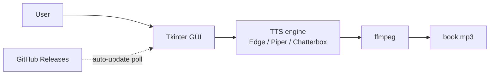

# AudiobookMaker

[](https://github.com/MikkoNumminen/AudiobookMaker/actions/workflows/build-release.yml)
[](https://github.com/MikkoNumminen/AudiobookMaker/actions/workflows/build-launcher.yml)
[](https://github.com/MikkoNumminen/AudiobookMaker/releases/latest)
[](https://github.com/MikkoNumminen/AudiobookMaker/releases)
[](https://github.com/MikkoNumminen/AudiobookMaker/releases/latest)
[](https://www.python.org/downloads/)
[](LICENSE.txt)
[](tests/)
[](#status)

Turn a PDF (or plain text) into an audiobook. Pick a file, press a button, get an MP3.

Works best with Finnish text. Other languages work too, but the
support depends on which Engine you pick. Here's the honest
breakdown:

| Language | Edge-TTS | Piper | Chatterbox       | VoxCPM2 |
|----------|----------|-------|------------------|---------|
| Finnish  | Yes (Noora)      | Yes | Yes (Grandmom)   | Yes |
| English  | Yes (Jenny etc.) | Yes | Yes (Route B, Grandmom voice) | Yes |
| German   | Yes (Katja etc.) | Yes | —                | —   |
| Swedish  | Yes (Sofie)      | Yes | —                | —   |
| French   | Yes (Denise etc.)| Yes | —                | —   |
| Spanish  | Yes (Elvira etc.)| Yes | —                | —   |

Quick guide to picking an Engine:

- **Edge-TTS** is the widest coverage and sounds great, but needs an
  internet connection — it calls Microsoft's cloud voices.
- **Piper** is fully offline and fast. It ships bundled voice models
  for the six Languages above.
- **Chatterbox** gives the highest quality for Finnish through the
  Grandmom Voice. English works too via the "Route B" recipe (the
  multilingual base model with Grandmom as the reference clip), so
  you get Grandmom's timbre reading English natively. Other Languages
  are not supported here.
- **VoxCPM2** is an experimental local neural Engine, currently
  wired up for Finnish and English only in the GUI.

## Hear it first

These clips were made by AudiobookMaker using the "Grandmom" voice
(Chatterbox engine). Both source texts are **public domain** — their
copyrights expired long ago because the authors died over 70 years
ago. That means anyone can read, record, or remix them freely. We
picked well-known classics so you can judge the voice quality on text
you might actually recognize.

**Finnish — Aleksis Kivi, *Seitsemän veljestä* (1870)**

https://github.com/MikkoNumminen/AudiobookMaker/raw/master/assets/demos/finnish_grandmom_kivi.mp3

**English — Edward Gibbon, *The Decline and Fall of the Roman Empire* (1776)**

https://github.com/MikkoNumminen/AudiobookMaker/raw/master/assets/demos/english_grandmom_gibbon.mp3

## Status

Active development. Things are moving fast and a few releases per
week is normal right now.

**What's stable:** the core PDF-to-MP3 flow with Edge-TTS (online) and
Piper (offline). Tested end-to-end with a real 10-hour Finnish
audiobook that came out sounding great. Installer works. Auto-updates
work.

**What's still getting rough edges sanded off:** Chatterbox voice
cloning, VoxCPM2 engine, the in-app engine installer, and some UI
corners. These work but you might hit a snag.

If you hit a bug, open an issue -- they get fixed fast. The
`Build and Release` badge at the top tells you whether CI is green
right now.

## What's new

**v3.9.0** -- Import voice packs, Cold Forge redesign, and a much
bigger test suite keeping it all honest:

- **Import voice pack button** -- a new button in Settings opens a
  folder picker, copies the pack to `~/.audiobookmaker/voice_packs/`,
  and the voice shows up next to Grandmom in the Voice dropdown. Picks
  from a pack auto-wire the reference audio so Chatterbox clones from
  it without you having to point at a file manually. Voice packs are a
  bundle of a reference clip and metadata; the pipeline to build them
  from source recordings lives under `scripts/voice_pack_*`
- **Cold Forge design system** -- a new theme module (`gui_style.py`)
  centralises fonts, spacing, colours, and icons so the whole window
  follows one consistent visual language. Replaces the old mix of
  hardcoded colour literals
- **Chatterbox registered like every other engine** -- Chatterbox now
  plugs into the shared engine registry via a subprocess-aware bridge
  class (`tts_chatterbox_bridge.py`). The GUI picks Chatterbox the same
  way it picks Edge-TTS or Piper; the subprocess split is an
  implementation detail behind a `uses_subprocess = True` flag
- **GUI builders split out of `gui_unified.py`** -- header bar, engine
  bar, settings panel, and action row each live in their own module
  under `src/gui_builders/`, so the main window file reads like
  glue-code instead of a 3000-line god class
- **Stress-tested Chatterbox long-run** -- the 500-call Tier 1 validator
  exercises the same engine handle across hundreds of synthesis calls
  and now holds memory flat through the whole run. Fixes an upstream
  EOS-suppression bug that caused occasional swallowed sentences on
  multi-hour books
- **1565 tests passing** -- pre-commit hooks and CI enforce the full
  suite before any commit. Test count grew from 618 → 1565 over the
  recent audit pass

**v3.7.0** -- Sample button, language picker up front, and English
audiobooks that finally sound English:

- **Make Sample button** -- a new button sits next to Convert. Click
  it and the app generates a ~30-second sample from the start of your
  book and saves it to `<book>_sample.mp3` next to the planned output.
  Lets you A/B two engines or voices in seconds before committing to
  a multi-hour full run
- **Language picker moved to the main bar** -- "Language" now sits
  next to Engine and Voice (was buried in Settings). Picking a
  language filters the Engine and Voice dropdowns so you only see
  what actually works in that language. The setting sticks across
  restarts; first launch defaults to Finnish if Windows is in
  Finnish, English otherwise
- **English audiobooks read like English audiobooks** -- Chatterbox
  in English mode no longer quietly applies Finnish rules (Roman
  numerals as Finnish ordinals, Finnish case inflection on numbers,
  and so on). The normalizer now dispatches by language
- **English text normalizer** -- full rules for English currency,
  units, time, dates, telephone numbers, URLs and emails, and
  acronyms. Numbers, money, and dates in English books finally sound
  natural
- **41 Edge-TTS voices, 25 Piper voices** -- large voice catalogue
  expansion across the supported languages
- **Chatterbox Grandmom per language** -- one voice entry per
  language (Grandmom (Finnish), Grandmom (English)) so the dropdown
  matches what you actually get

**v3.6** -- Live ETA and an auto-updater that can recover on its own:

- **Sticky status strip with live ETA** -- a status line pinned under
  the toolbar shows current progress and remaining time, and gives
  you a pre-synthesis estimate so you know roughly how long a book
  will take BEFORE you start
- **Self-healing SHA-256 fallback** -- if the release notes are
  missing the security hash, the app falls back to a sidecar
  `.exe.sha256` file. No manual intervention needed
- **Open in browser fallback** -- when an auto-update is blocked
  (antivirus, permissions, network hiccup), the update banner now
  includes an "Open in browser" button so you can always grab the
  installer manually
- **Foreground after update** -- the app now pops itself to the
  front after a successful auto-install instead of silently opening
  behind your browser
- **Periodic re-check + real errors** -- the app re-checks for
  updates every 4 hours, and download failures now show a proper
  error message instead of failing silently
- **Chatterbox subprocess hotfix** -- ffmpeg path is now correctly
  wired into the Chatterbox subprocess, and the audio/chunking/
  normalizer modules are bundled into the installer so Chatterbox
  no longer crashes on first run

**v3.5** -- Grandmom speaks English, plus a lot of quiet polish:

- **Grandmom speaks English** -- the default Chatterbox voice now
  works natively in English via voice-cloning, not just Finnish
- **Open in browser for every update** -- the update banner always
  includes a browser-download link as a safety net, no matter what
  the auto-updater is doing
- **Launcher help link works again** -- the in-app "Help" link from
  the launcher now points at the README instead of a dead URL, and
  stray old-branding references were scrubbed
- **Hardened cleanup paths** -- Piper and Chatterbox setup no longer
  leave half-downloaded files behind when something goes wrong
  mid-download

**v3.4** -- Read EPUB files too:

- **EPUB and TXT input** -- the "Book" tab now accepts EPUB and plain
  `.txt` files alongside PDF. Same flow: pick a file, pick a voice,
  press Convert

**v3.3** -- Naming, reliability, and a rescue when you reinstall:

- **Default Chatterbox voice is "Grandmom"** -- the stock cloning
  voice has a proper name instead of an opaque file id, so you can
  tell voices apart in the dropdown
- **Your MP3s survive a reinstall** -- uninstalling or updating no
  longer wipes MP3s sitting in the install folder. The cleanup step
  rescues user audio before removing old app files
- **Piper setup actually finishes** -- the `espeakbridge` native
  component is now bundled correctly, so Piper no longer fails to
  load with a cryptic import error on first run
- **Update button stops double-firing** -- the update banner's
  click handler no longer runs twice on some clicks, which had
  occasionally stalled the install

**v3.2** -- Polish pass on the install and update experience:

- **Goat splash on startup and during updates** -- the goat icon
  appears the moment the app starts, and stays on screen through
  the 10-15 second update gap so you never wonder if the app crashed
- **Running version shown in the title bar** -- `AudiobookMaker v3.8.0`
  so you can confirm which build is actually running after an update
- **Progress bar reaches 100%** -- "Valmis!" no longer appears while
  the bar is still at 85%. Every gain counts, visibly
- **Chunk progress lines are green** -- successful `[chapter N/N]
  chunk M/K` steps render green so you can watch progress at a glance
- **Warning-free log panel** -- upstream cosmetic warnings from torch,
  diffusers, transformers, and HuggingFace Hub are suppressed at the
  source. Real warnings still show up yellow
- **Chatterbox alignment fix shown as info** -- when our EOS loop-break
  kicks in, the log shows one calm `[info] alignment fix applied...`
  line instead of two scary red warnings
- **Generated files save to the install folder root** -- no more
  burrowing into an `audiobooks\` subdirectory. MP3s land next to the
  app .exe and survive uninstall/reinstall
- **Auto-bump output filenames** -- `Muunna` never overwrites a
  previous `texttospeech_N.mp3`; the next free number is picked
  automatically
- **Self-healing auto-updater** -- if the silent install fails for
  any reason, the next launch detects it and offers a visible
  installer fallback

**v2.3** -- Major update. Modern UI, more voices, auto-updates, and
a lot of fixes to make everything actually work reliably:

- **Modern look** -- the app uses CustomTkinter with dark/light mode
  that follows your Windows theme automatically
- **Listen button** -- type text, click Listen, hear it spoken right
  away. No need to save a file first. Great for trying out voices
- **30+ voices in 6 languages** -- Finnish, English, German, Swedish,
  French, and Spanish voices from Edge-TTS. Offline Piper voices for
  Finnish, English, and German
- **Auto-updates** -- the app checks for new versions every 5 minutes.
  When one is found, a banner appears at the top. Click it and the app
  downloads, installs, and restarts itself. No manual downloads needed
  after the first install
- **Voice recording** -- record your own voice directly from the app
  and use it for voice cloning with Chatterbox
- **Chatterbox works with text** -- you can type or paste text and
  synthesize it with Chatterbox. Previously only PDF input was
  supported
- **Smart language detection** -- the app detects your Windows language
  and picks Finnish or English UI automatically on first run
- **Single-instance guard** -- prevents accidentally opening two copies
  of the app, which could cause file conflicts or GPU crashes. If you
  need two windows (e.g. different engines on different files), the app
  asks you to confirm
- **Automatic output paths** -- no more file-picker dialogs before you
  start. PDF input saves the MP3 next to the PDF. Text input saves to
  Documents/AudiobookMaker with auto-incrementing filenames
- **500+ tests** -- pre-commit hooks and CI enforce that all tests pass
  before any code ships

**v2.0.0** -- Unified app:

- One download replaces both old installers (Main and Launcher)
- Finnish/English UI toggle
- Plain text input alongside PDF
- In-app engine installer for Chatterbox

---

## Two ways to use AudiobookMaker

| | Installer | Developer (clone the repo) |
|---|---|---|
| **Who is it for?** | Anyone with a Windows PC | Developers who want to tinker |
| **How do you get it?** | Download one .exe, install, done | Clone the repo, set up Python |
| **Voice engines** | Edge-TTS + Piper out of the box; Chatterbox via in-app install | Everything, including experimental engines |
| **Works offline?** | With Piper or Chatterbox | Yes, after first setup |
| **Needs a GPU?** | No (Chatterbox needs NVIDIA 8+ GB) | Depends on which engine you pick |
| **Voice cloning?** | Yes, with Chatterbox | Yes |
| **Languages** | Finnish, English, German, Swedish, French, Spanish | Same |
| **Download size** | ~200 MB (Chatterbox adds ~15 GB) | Varies |

---

## Installation

**Download:** [AudiobookMaker v3.8.0](https://github.com/MikkoNumminen/AudiobookMaker/releases/tag/v3.8.0)

**How to install:**
1. Download `AudiobookMaker-Setup-3.8.0.exe`
2. Double-click it. Windows will show a SmartScreen warning because the
   installer isn't signed -- click **More info**, then **Run anyway**
3. Click Next a few times, done
4. Open AudiobookMaker from the Start Menu

**Already have an older version?** The app checks for updates
automatically. When a new version is available, a banner appears at the
top of the window -- click "Update now" and the app handles everything.
No manual downloads, no installer prompts.

**What you get right away:**
- A window where you pick a PDF or type/paste text, choose a voice, and
  click Convert -- or click Listen to hear it spoken immediately
- Two voice engines:
  - **Edge-TTS** (needs internet) -- Microsoft's cloud voices. 30+
    voices across 6 languages. Fast, free, sounds good
  - **Piper** (works offline) -- downloads a voice model once (~60 MB),
    then works without internet forever
- Modern dark/light mode UI that follows your Windows setting
- The app detects your system language and starts in Finnish or English
  automatically
- No Python, no GPU, no command line needed

**Want the best Finnish voice quality?**

If you have an NVIDIA graphics card (RTX 3060 or better, 8+ GB video
memory), you can add Chatterbox right from inside the app:

1. Click **Install engines** in the app
2. The app downloads and sets up Chatterbox (~15 GB). A progress
   indicator shows what's happening
3. When it's done, Chatterbox appears as a voice engine option

With Chatterbox you also get:
- **Voice cloning** -- record a short clip of someone's voice, and the
  audiobook will sound like that person
- **Finnish text intelligence** -- the app understands Finnish grammar
  and reads numbers, dates, abbreviations, legal references, and
  loanwords the way a human would. For example:
  - `1300-luvulla` is read as "tuhat kolmesataa luvulla"
  - `esim.` is read as "esimerkiksi"
  - `5 %` is read as "viisi prosenttia"
  - `sivulta 42` inflects the number to match Finnish case grammar

---

## First audiobook: the numbers

We fed a real Finnish book into AudiobookMaker to see what happens.
Here's what came out:

| What | Number |
|------|--------|
| Pages in the PDF | 180 |
| Words the app read | ~65,000 |
| Finnish numbers, dates, and abbreviations normalized | ~2,400 |
| Audio chunks synthesized | ~1,200 |
| Total spoken audio | ~4.5 hours |
| Time to convert (Chatterbox, RTX 3080 Ti) | ~90 minutes |
| Output MP3 size | ~250 MB |
| Chapters detected automatically | 12 |

The app chewed through the whole thing unattended. It turned
`sivulta 42` into the correctly inflected Finnish, expanded every
`esim.` into `esimerkiksi`, and read `1300-luvulla` the way a Finnish
person would say it out loud.

No manual editing needed. Drop a PDF in, press a button, go make
coffee, come back to a finished audiobook.

---

## Real-world use

A law student used AudiobookMaker to turn a stack of study material
into audio. They wanted to listen to it while walking the dog, which
is a normal thing students do -- walks are long, dogs need the
exercise, and school reading has to happen somehow.

Before finding this app, they had tried the usual free options:

- Copy the text into Word and click "Read aloud". Word mispronounces
  abbreviations and the voice sounds robotic
- Let Microsoft Edge read the PDF out loud. Same kind of voice, even
  lower quality
- Pay for ready-made audiobooks meant for students. Some had a real
  human reading, which sounded great. Others used an AI voice, which
  sometimes glitched on a word or skipped a page

AudiobookMaker did better than all the automated options and held its
own against the human-narrated ones. It didn't trip on abbreviations.
It didn't skip pages. Finnish numbers and case endings came out right.
Emphasis landed in the right spots.

Here's what the student said after a few hours of listening:

> "That's insanely good. I get this mental image of a 60-plus grandma
> with reading glasses reading it somewhere in a cabin."

> "Better than anything I've listened to so far for study material.
> 5/5."

The "grandma in a cabin" bit is the part we care about most. The
point isn't just that the words are correct. It's that the voice has
enough character that your brain builds a picture of who is reading
to you, and sticks with it for hours.

One practical question came up: does 1.25x playback muddle the audio?
The answer: every audio player has its own speed control, so the app
doesn't need to. Make the audiobook once at normal speed, then speed
it up in your player when you want to get through it faster.

---

## Why the SmartScreen warning?

The installer is unsigned. Windows shows a scary-looking warning for
every unsigned program from an unknown publisher. Getting rid of this
warning requires a code-signing certificate ($100-300/year), which the
project doesn't have yet.

The installer is safe -- its entire build process is open source
in this repository and runs automatically on GitHub's servers on every
release. You can read every line of code that goes into it.

---

## Developer setup

**Best for:** You want to modify the code, experiment with different
TTS engines, or contribute to the project.

Cloning the repo gives you access to everything: all TTS engines, all
normalizer passes, experimental scripts, voice cloning tools, and the
full test suite.

### Getting started

Requires Python 3.11+, ffmpeg on PATH.

```bash
git clone <repo>
cd AudiobookMaker
python -m venv .venv
source .venv/bin/activate  # Windows: .venv\Scripts\activate
pip install -r requirements.txt
python -m src.main
```

Run tests:

```bash
pytest tests/
```

### TTS engines available in dev mode

**Edge-TTS** and **Piper** work the same as in the installer.

**Chatterbox-Finnish** needs a separate venv because it has heavy
dependencies (PyTorch, CUDA). The setup script handles everything:

```bash
powershell -ExecutionPolicy Bypass -File scripts\setup_chatterbox_windows.ps1
```

This creates `.venv-chatterbox/`, installs CUDA-enabled PyTorch,
downloads the AI models (~5 GB), and applies necessary patches.

**VoxCPM2** is an experimental engine from OpenBMB. It supports voice
cloning and natural-language voice design ("warm baritone elderly
male"). Not tested thoroughly -- install with `pip install voxcpm` if
you want to experiment. Requires NVIDIA GPU with ~8 GB VRAM.

### Developer scripts

These are standalone tools at the repo root and in `scripts/`. They
are not part of the shipped installer.

- **`dev_chatterbox_fi.py`** -- synthesize text with Chatterbox-Finnish
  from the command line. Run with `--help` for options
- **`scripts/generate_chatterbox_audiobook.py`** -- full book synthesis
  from PDF (or plain text file) to MP3 via Chatterbox. Resumable (safe
  to Ctrl-C and restart)
- **`scripts/generate_audiobook_parallel.py`** -- parallel Edge-TTS
  generator, about 8x faster than the GUI for large books
- **`scripts/record_voice_sample.py`** -- record a voice clip, validate
  its quality, and synthesize text in the cloned voice
- **`dev_qwen_tts.py`** -- Qwen3-TTS experiment. **Abandoned** --
  Finnish isn't supported, MPS is broken, CPU is too slow. Kept so
  nobody re-investigates the same dead end

### Finnish text normalizer

The normalizer makes Finnish numbers, abbreviations, and special terms
sound natural when read aloud. It runs automatically when using
Chatterbox-Finnish (via the app or dev scripts).

It works as a series of 16 text transformation passes covering:

- Century expressions (`1300-luvulla`)
- Year numbers and numeric ranges
- Abbreviations (`esim.`, `prof.`, `jne.`)
- Roman numerals with context-aware ordinal detection
- Unit symbols (`%`, `km`, `kg`)
- Section signs
- Finnish case inflection for numbers after prepositions
- Loanword respelling for words the AI mispronounces
- Various cleanup (ISBN stripping, TOC dot-leaders, metadata)

The normalizer has 400+ unit tests. See
[`docs/tts_text_normalization_cases.md`](docs/tts_text_normalization_cases.md)
for the full inventory.

### Known upstream issue

Chatterbox-TTS v0.1.7 has a bug where repeated calls to `generate()`
leak PyTorch hooks and corrupt internal state. Our scripts work around
this automatically. We've reported the bug and submitted a fix:
[resemble-ai/chatterbox#504](https://github.com/resemble-ai/chatterbox/issues/504),
[resemble-ai/chatterbox#505](https://github.com/resemble-ai/chatterbox/pull/505).

---

## How it fits together



The GUI hands text + voice choice to one of the TTS engines. Edge-TTS
and Piper run in-process; Chatterbox runs as a subprocess in its own
Python 3.11 venv. All three emit audio chunks that ffmpeg stitches into
a final MP3 saved next to `AudiobookMaker.exe`. The app polls GitHub
Releases every five minutes for a newer version and can install it in
place.

For the full architecture — engine registry, text pipeline, subprocess
bridge, auto-update flow, cleanup — see
[`docs/ARCHITECTURE.md`](docs/ARCHITECTURE.md).

---

## Project structure

```
AudiobookMaker/
├── src/
│   ├── main.py                    # App entry point + single-instance guard
│   ├── gui_unified.py             # CustomTkinter GUI (unified window)
│   ├── gui_builders/              # Per-section widget builders
│   ├── gui_style.py               # Cold Forge design tokens
│   ├── gui_synth_mixin.py         # Synthesis orchestration mixin
│   ├── gui_update_mixin.py        # Auto-update banner mixin
│   ├── synthesis_orchestrator.py  # Input→output routing helpers
│   ├── engine_registry.py         # Single import point for engines
│   ├── auto_updater.py            # GitHub-based auto-update checker
│   ├── system_checks.py           # GPU, disk, Python detection
│   ├── engine_installer.py        # In-app engine installation
│   ├── single_instance.py         # Prevent multiple app instances
│   ├── voice_recorder.py          # In-app voice recording for cloning
│   ├── pdf_parser.py              # PDF text extraction and cleanup
│   ├── epub_parser.py             # EPUB chapter extraction
│   ├── tts_base.py                # TTS engine interface + registry
│   ├── tts_edge.py                # Edge-TTS adapter
│   ├── tts_piper.py               # Piper adapter
│   ├── tts_voxcpm.py              # VoxCPM2 adapter (dev only)
│   ├── tts_chatterbox_bridge.py   # Chatterbox registration (subprocess)
│   ├── tts_engine.py              # Text chunking, normalizer, audio combining
│   ├── tts_normalizer_fi.py       # Finnish normalizer (16 passes)
│   ├── tts_normalizer_en.py       # English normalizer (12 passes)
│   ├── launcher_bridge.py         # Chatterbox subprocess runner
│   ├── fi_loanwords.py            # Finnish loanword respelling
│   ├── app_config.py              # Settings persistence
│   ├── ffmpeg_path.py             # ffmpeg path helper
│   └── voice_pack/                # Voice pack artefact format + import
├── data/
│   └── fi_loanwords.yaml          # Loanword lexicon
├── tests/                         # Unit tests (1565)
├── scripts/                       # CLI tools, setup scripts, voice pack pipeline
├── docs/                          # Documentation and research notes
├── installer/                     # Inno Setup build scripts
├── assets/                        # Icons, design-system JSON, demo clips
├── .github/workflows/             # CI: auto-build installer on release
└── requirements.txt
```

## Limitations

- Edge-TTS needs an internet connection (it uses Microsoft's servers)
- Piper needs internet once to download each voice model (~60 MB)
- Chatterbox needs an NVIDIA GPU with 8+ GB video memory
- Scanned PDFs (where text is actually an image) don't work -- the text
  must be selectable in a PDF reader
- The Finnish normalizer is tuned for legal/historical prose. Other
  domains may have terms it doesn't handle yet

## License

MIT


