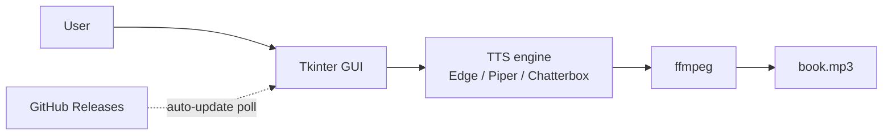

# AudiobookMaker

[](https://github.com/MikkoNumminen/AudiobookMaker/actions/workflows/build-release.yml)
[](https://github.com/MikkoNumminen/AudiobookMaker/actions/workflows/build-launcher.yml)
[](https://github.com/MikkoNumminen/AudiobookMaker/releases/latest)
[](https://github.com/MikkoNumminen/AudiobookMaker/releases)
[](https://github.com/MikkoNumminen/AudiobookMaker/releases/latest)
[](https://www.python.org/downloads/)
[](LICENSE.txt)
[](tests/)
[](#status)

[](https://github.com/MikkoNumminen/AudiobookMaker/stargazers)
[](https://github.com/MikkoNumminen/AudiobookMaker/commits/master)
[](https://github.com/MikkoNumminen/AudiobookMaker/pulse)
[](https://github.com/MikkoNumminen/AudiobookMaker/issues)
[](https://www.conventionalcommits.org)
[](https://github.com/MikkoNumminen/AudiobookMaker/pulls)

Turn a PDF, EPUB, or plain text file into an audiobook. Pick a file, press a button, get an MP3.

The app reads Finnish best, and English almost as well. Those are the
two languages you can pick in the Language menu today. Other languages
aren't in the menu yet — the voices exist underneath, but nobody has
tested them carefully enough to put them in front of you. Here's what
you get with each Engine:

| Language | Edge-TTS          | Piper | Chatterbox                    | VoxCPM2 (dev only) |
|----------|-------------------|-------|-------------------------------|--------------------|
| Finnish  | Yes (Noora)       | Yes   | Yes (Grandmom)                | Yes |
| English  | Yes (Jenny etc.)  | Yes   | Yes (Route B, Grandmom voice) | Yes |

Which Engine should you pick? Short answer: try Edge-TTS first, it's
the quickest to hear something. Longer answer:

- **Edge-TTS** uses Microsoft's cloud voices. You need an internet
  connection because the voice lives on their servers, not your
  computer. It's fast, free, and sounds very good. The trade-off is
  that you can't use it on a plane or in a cabin with no Wi-Fi.
- **Piper** runs entirely on your own computer. The first time you
  pick a voice it downloads a small voice file (about the size of a
  phone photo), and after that it works forever without internet.
  Not quite as smooth as Edge-TTS but very close, and it's yours.
- **Chatterbox** is the quality champion for Finnish. It uses a voice
  called Grandmom that sounds like, well, a grandma reading to you.
  English also works: we take the same Grandmom voice and have her
  read English text (this is what "Route B" means — think of it as
  Grandmom wearing a second hat). Downside: it needs an NVIDIA
  graphics card with 8 GB or more of video memory, and the first-time
  setup downloads about 15 GB. Other languages beyond Finnish and
  English don't work here.
- **VoxCPM2** is a science-experiment engine. It's powerful but not
  ready for normal users, so it's hidden unless you're working from
  the source code. The installer leaves it out on purpose. If you
  download the `.exe` from the Releases page, you won't see it in the
  Engine menu — and that's intentional, not a bug.

## Hear it first

These clips were made by AudiobookMaker using the "Grandmom" voice
(Chatterbox engine). Both source texts are **public domain** — their
copyrights expired long ago because the authors died over 70 years
ago. That means anyone can read, record, or remix them freely. We
picked well-known classics so you can judge the voice quality on text
you might actually recognize.

**Finnish — Aleksis Kivi, *Seitsemän veljestä* (1870)**

https://github.com/MikkoNumminen/AudiobookMaker/raw/master/assets/demos/finnish_grandmom_kivi.mp3

**English — Edward Gibbon, *The Decline and Fall of the Roman Empire* (1776)**

https://github.com/MikkoNumminen/AudiobookMaker/raw/master/assets/demos/english_grandmom_gibbon.mp3

## Status

Active development. Things are moving fast and a few releases per
week is normal right now.

**What's stable:** the core PDF-to-MP3 flow with Edge-TTS (online) and
Piper (offline). Tested end-to-end with a real 10-hour Finnish
audiobook that came out sounding great. Installer works. Auto-updates
work.

**What's still getting rough edges sanded off:** Chatterbox voice
cloning, VoxCPM2 engine, the in-app engine installer, and some UI
corners. These work but you might hit a snag.

If you hit a bug, open an issue -- they get fixed fast. The
`Build and Release` badge at the top tells you whether CI is green
right now.

## What's new

**v3.11.0** -- GUI polish for the main workflow and voice-pack plumbing:

- **Buttons light up when they are ready** -- Convert and Make sample
  stay greyed out until you pick both an input and a voice. Preview
  and Open folder stay greyed out until there is actually a finished
  audiobook to open. Fewer buttons you can click that do nothing
- **Progress bar only when something is happening** -- the thin blue
  bar at the bottom now hides itself when nothing is running. No more
  static zero-percent bar staring back at you from an idle app
- **Chatterbox chunk-size dial hides when you are not using Chatterbox**
  -- the "chunk size" spinbox only matters for the Finnish Chatterbox
  engine. Pick Edge-TTS or Piper and the control disappears, so the
  Settings panel shows just the knobs that actually affect your run
- **Workflow grouping in the action row** -- a thin vertical divider
  splits the action buttons into two honest halves: on the left, the
  things that *produce* output (Convert, Make sample); on the right,
  the things that let you *review* output (Preview, Open folder).
  Convert stays visually dominant
- **Voice packs now load their LoRA adapter at synthesis time** -- if
  you imported or cloned a voice pack that was trained on more data
  (reduced or full LoRA tier), the synthesis subprocess now actually
  wires the adapter into the Chatterbox model instead of falling
  back to the bare reference clip. Few-shot packs keep working the
  same as before
- **Voice Cloner survives the PyTorch 2.6 upgrade** -- the diarizer
  (the part that figures out who is speaking in your audio file) was
  crashing on checkpoint load after PyTorch's security defaults
  changed. Two compatibility shims now make pyannote load cleanly
  again and sidestep a separate speechbrain stack-walk bug that was
  aborting mid-pipeline on some machines
- **1884 tests passing** -- up from 1878

Older releases (v3.10.0 back to v2.0.0) live in
[docs/RELEASES.md](docs/RELEASES.md) so this page stays focused on what
just shipped.

---

## Two ways to use AudiobookMaker

| | Installer | Developer (clone the repo) |
|---|---|---|
| **Who is it for?** | Anyone with a Windows PC | Developers who want to tinker |
| **How do you get it?** | Download one .exe, install, done | Clone the repo, set up Python |
| **Voice engines** | Edge-TTS + Piper out of the box; Chatterbox via in-app install | Everything, including experimental engines |
| **Works offline?** | With Piper or Chatterbox | Yes, after first setup |
| **Needs a GPU?** | No (Chatterbox needs NVIDIA 8+ GB) | Depends on which engine you pick |
| **Voice cloning?** | Yes, with Chatterbox | Yes |
| **Languages** | Finnish, English, German, Swedish, French, Spanish | Same |
| **Download size** | ~200 MB (Chatterbox adds ~15 GB) | Varies |

---

## Installation

**Download:** [AudiobookMaker v3.11.0](https://github.com/MikkoNumminen/AudiobookMaker/releases/tag/v3.11.0)

**How to install:**
1. Download `AudiobookMaker-Setup-3.11.0.exe`
2. Double-click it. Windows will show a SmartScreen warning because the
   installer isn't signed -- click **More info**, then **Run anyway**
3. Click Next a few times, done
4. Open AudiobookMaker from the Start Menu

**Already have an older version?** The app checks for updates
automatically. When a new version is available, a banner appears at the
top of the window -- click "Update now" and the app handles everything.
No manual downloads, no installer prompts.

---

## What you can do in the GUI

You installed the app. Now what? Here is the whole tour of what the
main window does -- no code, no command line, no Python. Think of this
as the "things you can actually click" section.

### Turn a book into an MP3

The main job. Drop a **PDF**, an **EPUB**, or a plain **.txt** file into
the Book tab. Pick a **Language** (Finnish or English), pick an
**Engine** (Edge-TTS, Piper, or Chatterbox), pick a **Voice**. Click
**Convert**. Go make coffee. You come back to one MP3 saved next to the
app (or split per chapter if you flipped the Output toggle).

### Type text and listen instantly

No file? Click the **Text** tab, paste in whatever you want spoken,
click **Preview** -- the voice reads it back through the built-in audio
player. No file save required. Good for testing a voice before
committing a 10-hour book to it.

### Make a 30-second sample before committing to a whole book

Click **Make sample** and the app synthesizes only the first ~30 seconds
of your book and saves it as `<book>_sample.mp3` next to where the full
run would land. Takes a minute instead of an hour, so you can A/B two
engines or voices in seconds. The button stays greyed out until you
have picked both an input and a voice, so you can't accidentally make
an empty sample.

### Three engines, three personalities

- **Edge-TTS** -- Microsoft's cloud voices. Needs internet, sounds
  great, 30+ voices across six languages. The fastest way to hear
  something.
- **Piper** -- Lives on your computer. Downloads a voice model once
  (about a phone photo in size), then works forever without internet.
  Not quite as smooth as Edge-TTS but very close.
- **Chatterbox** -- The quality champion for Finnish. Needs an NVIDIA
  graphics card, and the first-time setup is big (~15 GB of AI model).
  The default voice is called **Grandmom** -- a warm elderly narrator
  that sounds like somebody reading to you in a cabin.

The **Language** picker at the top of the window filters the Engine and
Voice dropdowns so you only see things that actually speak your
language.

### Install Chatterbox (and the Voice Cloner) without leaving the app

The **Install engines** button in Settings opens the Engine Manager.
Each engine has its own row with an Install / Remove button, and there
is an "Extras" row below the engines for **Voice Cloner** (the thing
that listens to audio files and pulls voices out of them). Everything
downloads in the background with a progress bar; you never touch a
terminal.

### Import a voice pack somebody else built

Got a voice pack folder from a collaborator or a previous run? Click
**Import voice pack** in Settings, point at the folder, and the voice
shows up in the Voice dropdown next to Grandmom. The app auto-wires the
reference audio so Chatterbox clones from it without you having to
point at a file.

### Clone a voice from any audio file, right inside the app (new in v3.10.0)

This is the headline trick. Click **Clone voice from file** in Settings
(or drop a `.wav` / `.mp3` / `.m4a` / `.flac` / `.ogg` / `.m4b` onto
the main window). The app will:

1. Ask you how many voices are in the recording (1, 2, 3-8, or
   auto-detect) and which language.
2. Listen to the audio and figure out who is speaking when.
3. Show you each detected speaker with runtime minutes.
4. Ask you to name each voice you want to keep.
5. Save them, and the new voices appear in the Voice dropdown.

About ten minutes from drop to voice-in-dropdown for a five-minute
recording. Voice Cloner needs a one-time Hugging Face key setup on
first install -- the app walks you through it in three clicks with
browser buttons that take you to the right pages.

### Finnish text intelligence

When you use Chatterbox-Finnish, a text normalizer runs first and
fixes how abbreviations, numbers, dates, and Finnish case endings get
read aloud. For example:

- `1300-luvulla` becomes "tuhat kolmesataa luvulla"
- `esim.` becomes "esimerkiksi"
- `5 %` becomes "viisi prosenttia"
- `sivulta 42` inflects the number to match Finnish case grammar

You don't click anything. It just happens before the AI speaks. The
normalizer has 150+ unit tests behind it so the common cases don't
regress.

### Watch progress as it runs, and pick up where you left off

A status strip under the toolbar shows live progress and an estimated
finish time -- updated every chunk. If you Ctrl-C or Windows reboots,
re-running the same command picks up from the last finished chunk. You
don't re-synthesize what is already done.

### Report a bug in two clicks

The **Report a bug** link in Settings opens a pre-filled GitHub issue
with your app version, OS, and engine info. Fixes don't wait on you
remembering which build you were running.

### Auto-updates that actually work

The app polls GitHub every five minutes for a newer version. When one
lands, a banner appears at the top. Click it, the app downloads the
new installer, verifies its SHA-256 fingerprint, installs it silently,
and pops itself to the front of your screen when the update is done.
No manual downloads. No SmartScreen dance on every release.

### Finnish or English UI, follows your system

First launch picks Finnish if Windows is in Finnish, English
otherwise. You can override it under Settings -> Language (the UI
picker, separate from the book-language dropdown in the main bar).

---

## First audiobook: the numbers

We fed a real Finnish book into AudiobookMaker to see what happens.
Here's what came out:

| What | Number |
|------|--------|
| Pages in the PDF | 180 |
| Words the app read | ~65,000 |
| Finnish numbers, dates, and abbreviations normalized | ~2,400 |
| Audio chunks synthesized | ~1,200 |
| Total spoken audio | ~4.5 hours |
| Time to convert (Chatterbox, RTX 3080 Ti) | ~90 minutes |
| Output MP3 size | ~250 MB |
| Chapters detected automatically | 12 |

The app chewed through the whole thing unattended. It turned
`sivulta 42` into the correctly inflected Finnish, expanded every
`esim.` into `esimerkiksi`, and read `1300-luvulla` the way a Finnish
person would say it out loud.

No manual editing needed. Drop a PDF in, press a button, go make
coffee, come back to a finished audiobook.

---

## Real-world use

A law student used AudiobookMaker to turn a stack of study material
into audio. They wanted to listen to it while walking the dog, which
is a normal thing students do -- walks are long, dogs need the
exercise, and school reading has to happen somehow.

Before finding this app, they had tried the usual free options:

- Copy the text into Word and click "Read aloud". Word mispronounces
  abbreviations and the voice sounds robotic
- Let Microsoft Edge read the PDF out loud. Same kind of voice, even
  lower quality
- Pay for ready-made audiobooks meant for students. Some had a real
  human reading, which sounded great. Others used an AI voice, which
  sometimes glitched on a word or skipped a page

AudiobookMaker did better than all the automated options and held its
own against the human-narrated ones. It didn't trip on abbreviations.
It didn't skip pages. Finnish numbers and case endings came out right.
Emphasis landed in the right spots.

Here's what the student said after a few hours of listening:

> "That's insanely good. I get this mental image of a 60-plus grandma
> with reading glasses reading it somewhere in a cabin."

> "Better than anything I've listened to so far for study material.
> 5/5."

The "grandma in a cabin" bit is the part we care about most. The
point isn't just that the words are correct. It's that the voice has
enough character that your brain builds a picture of who is reading
to you, and sticks with it for hours.

One practical question came up: does 1.25x playback muddle the audio?
The answer: every audio player has its own speed control, so the app
doesn't need to. Make the audiobook once at normal speed, then speed
it up in your player when you want to get through it faster.

---

## Why the SmartScreen warning?

The installer is unsigned. Windows shows a scary-looking warning for
every unsigned program from an unknown publisher. Getting rid of this
warning requires a code-signing certificate ($100-300/year), which the
project doesn't have yet.

The installer is safe -- its entire build process is open source
in this repository and runs automatically on GitHub's servers on every
release. You can read every line of code that goes into it.

---

## What dev mode adds on top

The installer gives you a polished app that makes audiobooks. Cloning
the repo and running from source gives you **everything else** -- the
stuff that either isn't ready for normal users, or that makes more
sense from a terminal than from a button. Think of dev mode as the
back room of the same building.

### You can run the full voice-pack training pipeline

The GUI can **use** a trained voice pack and can **clone** a voice from
an audio file with no training at all. Dev mode can **train a new pack
from scratch** -- five command-line tools under `scripts/voice_pack_*`:

- `voice_pack_analyze.py` -- listens to a source recording, runs
  diarization + ASR, and writes a per-chunk transcript tagged with
  speaker labels
- `voice_pack_characters.py` -- optional stage that subclusters one
  speaker's chunks by voice so a narrator performing many characters
  can be split into per-character training sets
- `voice_pack_export.py` -- filters the transcript to a single speaker
  (or character), slices per-clip WAVs, and writes the training manifest
- `voice_pack_train.py` -- runs a LoRA fine-tune (this is the heavy,
  hours-long step; needs a GPU)
- `voice_pack_package.py` -- bundles the trained adapter + reference
  audio + metadata into an installable pack

The GUI clone-voice flow does the no-training version of this. The
full pipeline gives you reduced-LoRA and full-LoRA tiers, which
capture a voice's character much more faithfully at the cost of a
long training run.

### You get the experimental engines

- **VoxCPM2** -- a research engine with natural-language voice design
  ("warm baritone elderly male"). Works but hasn't been tested
  thoroughly. `pip install voxcpm`.
- The GUI dropdown **does not show** VoxCPM2 -- the engine registry
  filters it out in frozen builds. From source it appears like any
  other engine.

### You can synthesize books from the command line

`scripts/generate_chatterbox_audiobook.py` is the same synthesis path
the GUI uses underneath, exposed directly. Run it with `--epub book.epub
--out out/book.mp3 --language en --device cuda` and it will synthesize
the whole thing, chunk by chunk, resumable on Ctrl-C. Good for batch
runs across many books, or for scripting a custom workflow. The
step-by-step walkthrough lives in
[docs/QUICKSTART_DEV.md](docs/QUICKSTART_DEV.md).

`scripts/generate_audiobook_parallel.py` does the same thing with
Edge-TTS and is about 8× faster for large books (the cloud voice
takes parallel requests well).

### You can fix a mispronunciation yourself

When the Finnish voice mispronounces something -- a loanword, an
abbreviation, an odd number -- the fix is usually a two-line edit to
a YAML file in `data/fi_*.yaml` (the lexicon) or a small change to one
of the 16 passes in `src/tts_normalizer_fi.py`. Add a regression test
in `tests/test_tts_normalizer_fi.py` so it stays fixed.

The canonical guide to the passes and when to add one vs. edit the
lexicon lives in
[docs/CONVENTIONS.md](docs/CONVENTIONS.md#finnish-text-normalizer-lexicon-vs-new-pass).

### You get the full test suite

1884 tests and counting. The pre-commit hook runs them on every
commit; CI runs them on every push. Breaking a test gets caught
before it ever reaches master.

```bash
pytest tests/
```

### You can build the installer yourself

Everything CI does you can do locally -- PyInstaller bundle + Inno
Setup installer. See [BUILDING.md](BUILDING.md) for the exact steps.

---

## Developer setup

**Best for:** You want to modify the code, experiment with different
TTS engines, or contribute to the project.

Cloning the repo gives you access to everything: all TTS engines, all
normalizer passes, experimental scripts, voice cloning tools, and the
full test suite.

### Getting started

Requires Python 3.11+, ffmpeg on PATH.

```bash
git clone <repo>
cd AudiobookMaker
python -m venv .venv
source .venv/bin/activate  # Windows: .venv\Scripts\activate
pip install -r requirements.txt
python -m src.main
```

Run tests:

```bash
pytest tests/
```

### TTS engines available in dev mode

**Edge-TTS** and **Piper** work the same as in the installer.

**Chatterbox-Finnish** needs a separate venv because it has heavy
dependencies (PyTorch, CUDA). Easiest path: install the Windows `.exe`
and tick the **Chatterbox Finnish (GPU)** component during setup; the
installer creates `.venv-chatterbox/`, installs CUDA-enabled PyTorch,
downloads the AI models (~5 GB), and applies necessary patches.

If you're running from source, open the app (`python -m src.main`)
and click the **Install engines…** button in the Settings panel —
same work, same venv. See [docs/QUICKSTART_DEV.md](docs/QUICKSTART_DEV.md)
for Linux/Mac equivalent commands.

**VoxCPM2** is an experimental engine from OpenBMB. It supports voice
cloning and natural-language voice design ("warm baritone elderly
male"). Not tested thoroughly -- install with `pip install voxcpm` if
you want to experiment. Requires NVIDIA GPU with ~8 GB VRAM.

### Developer scripts

These are standalone tools at the repo root and in `scripts/`. They
are not part of the shipped installer.

- **`dev_chatterbox_fi.py`** -- synthesize text with Chatterbox-Finnish
  from the command line. Run with `--help` for options
- **`scripts/generate_chatterbox_audiobook.py`** -- full book synthesis
  from PDF (or plain text file) to MP3 via Chatterbox. Resumable (safe
  to Ctrl-C and restart)
- **`scripts/generate_audiobook_parallel.py`** -- parallel Edge-TTS
  generator, about 8x faster than the GUI for large books
- **`scripts/record_voice_sample.py`** -- record a voice clip, validate
  its quality, and synthesize text in the cloned voice.
  **Input-volume gotcha:** Zoom, Teams, and Discord silently lower the
  system mic level to roughly 5-10 % so you don't blow out calls. That
  level is too quiet for voice cloning -- the preflight SNR check will
  fail or the clone will sound whispery. Before recording, open the OS
  sound settings and raise the input volume to about 85 %, then speak
  at a normal conversational distance (~20 cm from the mic)
- **`dev_qwen_tts.py`** -- Qwen3-TTS experiment. **Abandoned** --
  Finnish isn't supported, MPS is broken, CPU is too slow. Kept so
  nobody re-investigates the same dead end

### Finnish text normalizer

The normalizer makes Finnish numbers, abbreviations, and special terms
sound natural when read aloud. It runs automatically when using
Chatterbox-Finnish (via the app or dev scripts).

It works as a series of 18 text transformation passes covering:

- Century expressions (`1300-luvulla`)
- Year numbers and numeric ranges
- Abbreviations (`esim.`, `prof.`, `jne.`)
- Roman numerals with context-aware ordinal detection
- Unit symbols (`%`, `km`, `kg`)
- Section signs
- Finnish case inflection for numbers after prepositions
- Loanword respelling for words the AI mispronounces
- Various cleanup (ISBN stripping, TOC dot-leaders, metadata)

The normalizer has 400+ unit tests. See
[`docs/tts_text_normalization_cases.md`](docs/tts_text_normalization_cases.md)
for the full inventory.

### Known upstream issue

Chatterbox-TTS v0.1.7 has a bug where repeated calls to `generate()`
leak PyTorch hooks and corrupt internal state. Our scripts work around
this automatically. We've reported the bug and submitted a fix:
[resemble-ai/chatterbox#504](https://github.com/resemble-ai/chatterbox/issues/504),
[resemble-ai/chatterbox#505](https://github.com/resemble-ai/chatterbox/pull/505).

---

## How it fits together



The GUI hands text + voice choice to one of the TTS engines. Edge-TTS
and Piper run in-process; Chatterbox runs as a subprocess in its own
Python 3.11 venv. All three emit audio chunks that ffmpeg stitches into
a final MP3 saved next to `AudiobookMaker.exe`. The app polls GitHub
Releases every five minutes for a newer version and can install it in
place.

For the full architecture — engine registry, text pipeline, subprocess
bridge, auto-update flow, cleanup — see
[`docs/ARCHITECTURE.md`](docs/ARCHITECTURE.md).

---

## Claude Code skills (measured)

The [`.claude/skills/`](.claude/skills/) directory holds four
custom skills for
[Claude Code](https://www.anthropic.com/claude-code) that automate
the repetitive, mistake-prone parts of maintaining this project. A
skill is a single `SKILL.md` file that Claude Code loads into its
context when a matching keyword is used, giving Claude a written
playbook for a recurring task.

Three of the four are domain-specific — `release-cut` knows exactly
which AudiobookMaker files to bump, `pronunciation-corpus-add` knows
where the Finnish pronunciation corpus lives — so they live in this
repository because detaching them would break them. The fourth,
`audit`, is universal by design: it ran first on this codebase and
is being promoted into its own standalone repo. Both places are
wired from the same idea: measure the benefit, don't guess.

### Measured impact

I maintain this project with up to four Claude Code sessions running
in parallel daily. Token deltas multiply quickly at that volume, so
a skill that shaves 15k tokens off a recurring task is not a
rounding error. At the same time, not every skill is about saving
tokens — some deliberately spend extra tokens so the output is more
correct. Both kinds are tracked below.

| Skill | Tokens (with / without) | Δ tokens | Pass rate (with / without) | Δ quality |
|---|---|---:|---|---:|
| [`release-cut`](.claude/skills/release-cut/SKILL.md) | 28,834 / 46,853 | **−38.5%** | 100% / 100% | tie |
| [`work-session`](.claude/skills/work-session/SKILL.md) | 26,762 / 33,098 | −19.1% | 94% / 80% | **+14 pp** |
| [`pronunciation-corpus-add`](.claude/skills/pronunciation-corpus-add/SKILL.md) | 27,170 / 29,661 | −8.4% | 100% / 89% | +11 pp |
| `fi-normalizer-pass` (prototype) | 48,496 / 43,941 | **+10.4%** | 100% / 83% | **+17 pp** |

All numbers are means across `n = 3` runs per configuration. Full
per-eval breakdown, the raw `benchmark.json`, and methodology notes
live in
[`benchmarks/skills-eval/`](benchmarks/skills-eval/).

The `fi-normalizer-pass` row is the interesting one. The skill
**costs** tokens, which would make it look bad if we only watched
the token column — but it lifts pass rate from 83% to 100% on hard
normalizer tasks. That is why both metrics are shown together:
measuring only one of them paints a misleading picture, and the
whole point is to decide honestly which skills to keep.

### What each skill does

- **[`release-cut`](.claude/skills/release-cut/SKILL.md)** — end-to-end
  release ritual: bump `APP_VERSION`, sync the installer `.iss`
  file, create the `vX.Y.Z` tag, watch CI, and verify the live
  release ships both the SHA-256 in the release notes and the
  sidecar `.exe.sha256` asset. Auto-update silently breaks if either
  is missing, so the skill encodes every guard. Triggered by "cut a
  release", "bump the version", "ship X.Y.Z".
- **[`work-session`](.claude/skills/work-session/SKILL.md)** —
  start, pause, or finish a task against the shared `TODO.md`
  protocol that coordinates multiple Claude Code sessions running in
  parallel. Without it, two sessions silently claim the same item
  and clobber each other's work. Triggered by "claim X", "take Y",
  "I'm done", "go idle".
- **[`pronunciation-corpus-add`](.claude/skills/pronunciation-corpus-add/SKILL.md)** —
  append a Finnish pronunciation-failure report to
  [`docs/pronunciation_corpus_fi.md`](docs/pronunciation_corpus_fi.md).
  Testers (and I) hit mispronunciations constantly; this skill makes
  logging them cheap enough that they actually get logged, instead
  of being lost in chat. Triggered by "Grandmom pronounced X as Y",
  "add to the corpus".
- **[`audit`](.claude/skills/audit/SKILL.md)** — comprehensive
  robustness audit: Phase 1 runs language-appropriate static analysis
  (Python / JS-TS / Rust / Go), Phase 2 spawns five parallel subagents
  across resource lifecycle, data integrity, concurrency, error
  paths, and external boundaries, Phase 3 writes
  `docs/audits/audit-YYYY-MM-DD.md` with a severity tally. First run
  on this repo produced 66 findings and 26 `fix(*)` commits. Universal
  by design — not AudiobookMaker-specific. Triggered by "audit this
  codebase", "find bugs", "robustness review". Not benchmarked yet.

### A note on methodology

Skill benchmarking is prone to cache luck — a single run's token
count can swing 20% depending on what Claude had cached from earlier
work. These numbers average across three runs per configuration,
with the prompt, model, and effort level held constant. That is
enough to separate real signal from noise; it is not enough to be a
scientific result. The caveats, the raw `benchmark.json`, and every
per-eval pass-rate breakdown are in
[`benchmarks/skills-eval/`](benchmarks/skills-eval/) so anyone can
see what the pass-rate rubrics actually checked and reach their own
conclusion.

---

## Project structure

```
AudiobookMaker/
├── src/
│   ├── main.py                    # App entry point + single-instance guard
│   ├── gui_unified.py             # CustomTkinter GUI (unified window)
│   ├── gui_builders/              # Per-section widget builders
│   ├── gui_style.py               # Cold Forge design tokens
│   ├── gui_synth_mixin.py         # Synthesis orchestration mixin
│   ├── gui_update_mixin.py        # Auto-update banner mixin
│   ├── synthesis_orchestrator.py  # Input→output routing helpers
│   ├── engine_registry.py         # Single import point for engines
│   ├── auto_updater.py            # GitHub-based auto-update checker
│   ├── system_checks.py           # GPU, disk, Python detection
│   ├── engine_installer.py        # In-app engine installation
│   ├── single_instance.py         # Prevent multiple app instances
│   ├── voice_recorder.py          # In-app voice recording for cloning
│   ├── pdf_parser.py              # PDF text extraction and cleanup
│   ├── epub_parser.py             # EPUB chapter extraction
│   ├── tts_base.py                # TTS engine interface + registry
│   ├── tts_edge.py                # Edge-TTS adapter
│   ├── tts_piper.py               # Piper adapter
│   ├── tts_voxcpm.py              # VoxCPM2 adapter (dev only)
│   ├── tts_chatterbox_bridge.py   # Chatterbox registration (subprocess)
│   ├── tts_engine.py              # Text chunking, normalizer, audio combining
│   ├── tts_normalizer_fi.py       # Finnish normalizer (18 passes)
│   ├── tts_normalizer_en.py       # English normalizer (18 passes)
│   ├── launcher_bridge.py         # Chatterbox subprocess runner
│   ├── fi_loanwords.py            # Finnish loanword respelling
│   ├── app_config.py              # Settings persistence
│   ├── ffmpeg_path.py             # ffmpeg path helper
│   └── voice_pack/                # Voice pack artefact format + import
├── data/
│   └── fi_loanwords.yaml          # Loanword lexicon
├── tests/                         # Unit tests (1884)
├── scripts/                       # CLI tools, setup scripts, voice pack pipeline
├── docs/                          # Documentation and research notes
├── installer/                     # Inno Setup build scripts
├── assets/                        # Icons, design-system JSON, demo clips
├── .claude/skills/                # Project-local Claude Code skills
├── benchmarks/skills-eval/        # Measured token + quality impact of the skills
├── .github/workflows/             # CI: auto-build installer on release
└── requirements.txt
```

## Limitations

- Edge-TTS needs an internet connection (it uses Microsoft's servers)
- Piper needs internet once to download each voice model (~60 MB)
- Chatterbox needs an NVIDIA GPU with 8+ GB video memory
- Scanned PDFs (where text is actually an image) don't work -- the text
  must be selectable in a PDF reader
- The Finnish normalizer is tuned for legal/historical prose. Other
  domains may have terms it doesn't handle yet

## License

MIT


