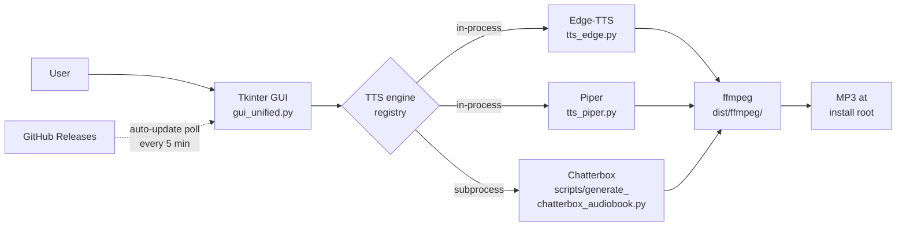
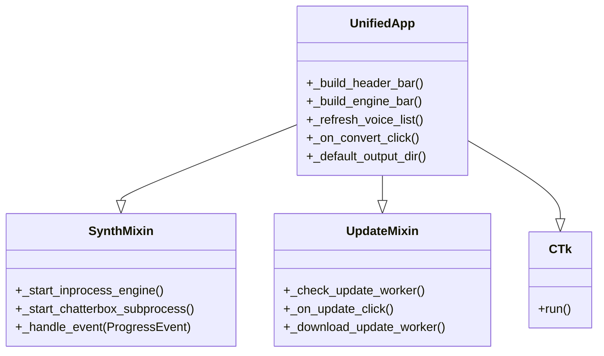
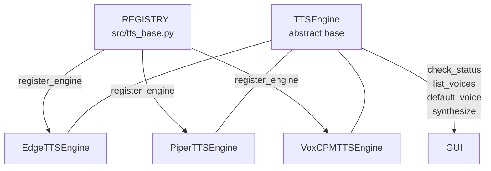
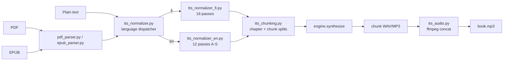
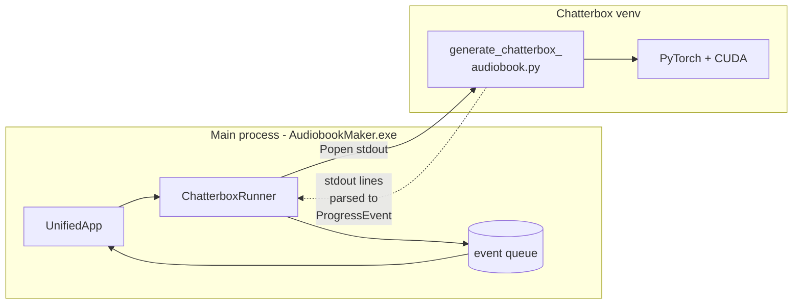
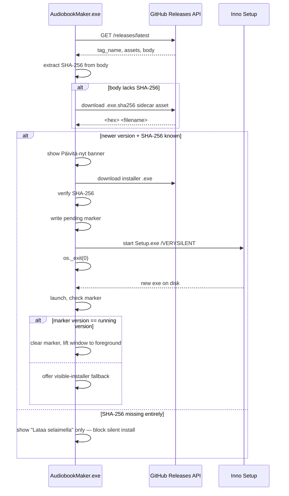

# Architecture

A reading guide to how AudiobookMaker fits together. Read this once at
the start of a session and you won't have to re-grep for where things
live.

## Bird's-eye view



The GUI is a single Tk window. It hands off the text + voice choice to
one of the TTS engines. Edge-TTS and Piper run in-process; Chatterbox
runs as a subprocess in its own Python 3.11 venv because of heavy ML
deps. All engines write chunks that ffmpeg stitches into a final MP3
stored next to `AudiobookMaker.exe`.

## GUI layer

`src/gui_unified.py` defines `UnifiedApp`, which inherits from two
mixins plus `customtkinter.CTk`:



Why mixins: orchestration (synthesis pump, update banner) is stateful
and ~500 lines each — keeping them on the main class would bloat
`gui_unified.py` past readable. Mixins use `typing.Protocol` to declare
the attributes they expect the host to provide, so type-checking still
works.

Further extracted pieces:
- `src/gui_engine_dialog.py` — "Asenna moottoreita…" modal view
- `src/gui_synth_mixin.py` — synthesis orchestration
- `src/gui_update_mixin.py` — auto-update banner + download

## TTS engine registry

All engines plug into a single registry in `src/tts_base.py`:



Each engine implements four methods:

| Method | Purpose |
|--------|---------|
| `check_status()` | Is this engine installed + ready? Returns `EngineStatus` |
| `list_voices(lang)` | Voices available for a given language |
| `default_voice(lang)` | Opinionated default per language |
| `synthesize(text, voice_id, out_path, …)` | Do the work |

Chatterbox is not registered — it runs as a separate process driven by
`src/launcher_bridge.py` + `scripts/generate_chatterbox_audiobook.py`
and is selected in the GUI via a hardcoded `"chatterbox_fi"` branch.
This is a deliberate split: Chatterbox needs PyTorch + CUDA + a 7 GB
model, all installed into its own venv so the main app bundle stays
~200 MB.

## Text pipeline



- `pdf_parser.py` — PyMuPDF, extracts chapters heuristically
- `epub_parser.py` — EPUB chapter extraction (same output shape as `pdf_parser`)
- `tts_normalizer.py` — language dispatcher. `normalize_text(text, lang)`
  routes to the per-language module; lazy-imports it so the unused side
  stays out of memory. Supported codes: `"fi"`, `"en"`. Unknown codes
  raise `ValueError`.
- `tts_normalizer_fi.py` — 16 transformation passes that make Finnish
  abbreviations, numbers, case endings, and dates readable. Runs before
  chunking so the chunker splits on fully expanded sentences. Covered by
  150+ unit tests; see [`tts_text_normalization_cases.md`](tts_text_normalization_cases.md)
- `tts_normalizer_en.py` — 12 English passes covering Roman numerals,
  abbreviations, dates, currency, units, time, telephone, URLs/emails,
  acronyms. Heavy passes O/P/R/S live in standalone `src/_en_pass_*.py`
  modules so they unit-test in isolation.
- `tts_chunking.py` — splits long text at sentence boundaries under a
  length cap the engine can handle
- `tts_audio.py` — thin wrapper around `pydub` + bundled ffmpeg

## Engine bar (Phase 2 — language-first)

The main window's engine bar is one row of three connected dropdowns:
**Language → Engine → Voice**. Picking a Language filters the Engine
dropdown to engines whose `supported_languages()` includes it; picking
an Engine filters the Voice dropdown via `engine.list_voices(language)`.

Three action buttons sit next to the dropdowns:
- **Convert** — full book to one or many MP3s (depending on the
  Output mode in Settings).
- **Make Sample** — synthesize the first ~30 s (~500 chars trimmed at
  a sentence boundary) of the input to `<book>_sample.mp3` next to the
  planned full-run target. For Chatterbox the sample is renamed out
  of the runner's nested folder by `_finalize_chatterbox_output_if_needed`.
- **Preview** — plays the most recent finished MP3 from the session via
  the OS player. Falls back to a quick text-only synthesis when no MP3
  exists yet.

Engine-bar callbacks (`_on_language_changed`, `_on_engine_changed`)
are wired AFTER `_apply_loaded_config()` runs, so loading saved
preferences during init never triggers the cascade.

## Subprocess & cross-process messaging

Chatterbox synthesis is a separate process. The GUI talks to it via
`src/launcher_bridge.py`:



The subprocess emits structured lines on stdout. `ChatterboxLineParser`
in `launcher_bridge.py` turns them into `ProgressEvent` dataclasses
(chunk/chapter/setup/exit). A reader thread pumps them into a
`queue.Queue` that the GUI drains on its Tk `after()` timer. Backpressure
is handled by the queue; cancellation flows the other way via
`threading.Event`.

## Auto-update



- `src/auto_updater.py` — GitHub API polling, SHA-256 from body OR
  `.exe.sha256` sidecar asset, download, integrity check, pending-marker
  lifecycle, installer invocation, post-update foreground pop.
- `installer/setup.iss` — Inno Setup script. PrivilegesRequired=lowest
  (installs to `%LOCALAPPDATA%\Programs\AudiobookMaker`). Registry-based
  auto-uninstall of any prior version before installing.
- `.github/workflows/build-release.yml` — on tag push (`v*`), builds the
  PyInstaller bundle on a Windows runner, wraps in Inno Setup, uploads
  the installer + a sidecar `.exe.sha256` text file, auto-injects the
  SHA-256 into the release notes, and post-publish-verifies that a hash
  is recoverable. Auto-update is treated as P0 — see `docs/CONVENTIONS.md`
  for the mandatory release guarantees.

Version numbering: `APP_VERSION` in `src/auto_updater.py` is the source
of truth. CI rewrites it from the git tag at build time, so dev-mode
runs use the committed value (useful for local testing).

## Cleanup of old installs

`src/cleanup.py` runs silently on startup. Scans known install paths
(AppData, Program Files, `C:\AudiobookMaker`, `D:\AudiobookMaker`,
`D:\koodaamista\AudiobookMakerApp`) and orphan Start-Menu / desktop /
taskbar shortcuts. For each old install:

1. Rescues any user MP3s (root or legacy `audiobooks/` subfolder) into
   the current install's output dir
2. Runs `unins000.exe /VERYSILENT` if available
3. Falls back to `shutil.rmtree`

Users never lose audiobooks to cleanup.

## File layout reference

```
src/
  main.py                    # entry point, single-instance guard
  gui_unified.py             # UnifiedApp, i18n strings, banner, widgets
  gui_synth_mixin.py         # synthesis orchestration
  gui_update_mixin.py        # auto-update banner + download
  gui_engine_dialog.py       # engine install/manage modal view
  auto_updater.py            # GitHub polling, download, apply_update()
  cleanup.py                 # old-install detection + MP3 rescue
  single_instance.py         # mutex against multiple app copies
  launcher_bridge.py         # ChatterboxRunner + ProgressEvent
  engine_installer.py        # in-app Chatterbox installer
  system_checks.py           # GPU, disk, Python 3.11 detection
  ffmpeg_path.py             # bundled-ffmpeg PATH wiring + pydub patching
  tts_base.py                # TTSEngine ABC + _REGISTRY
  tts_edge.py                # Edge-TTS adapter
  tts_piper.py               # Piper adapter
  tts_voxcpm.py              # VoxCPM2 adapter (dev only)
  tts_chunking.py            # sentence-aware text splitting
  tts_normalizer.py          # language dispatcher (fi / en routing)
  tts_normalizer_fi.py       # Finnish text → speakable form (16 passes)
  tts_normalizer_en.py       # English text → speakable form (12 passes A-S)
  _en_pass_o_dates.py        # English Pass O (dates) helper module
  _en_pass_p_telephone.py    # English Pass P (telephone numbers) helper
  _en_pass_r_urls.py         # English Pass R (URLs / emails) helper
  _en_pass_s_acronyms.py     # English Pass S (acronyms) helper
  tts_audio.py               # pydub/ffmpeg wrappers
  tts_engine.py              # TTSConfig + chapters_to_speech pipeline
  pdf_parser.py              # PyMuPDF chapter extraction
  epub_parser.py             # EPUB chapter extraction (same shape as pdf_parser)
  fi_loanwords.py            # loanword respelling lookup
  sample_helpers.py          # extract_sample_text + sample output path helpers
  duration_estimate.py       # pre-synthesis ETA estimate
  app_config.py              # settings persistence + system-locale defaults
  voice_recorder.py          # in-app mic capture for cloning

scripts/
  generate_chatterbox_audiobook.py  # runs in the Chatterbox venv

installer/
  setup.iss                  # Inno Setup script

audiobookmaker.spec          # PyInstaller spec (main app bundle)
```

## Legacy modules

Two earlier entry points are still on disk but are no longer the surface
new work should touch:

- `src/gui.py` — the original advanced-mode Tkinter window. Predates
  `gui_unified.py` and has hardcoded Finnish literals instead of the
  `_STRINGS` table. Kept so older build paths and any external callers
  that still import `src.gui` do not break.
- `src/launcher.py` — the first minimal launcher ("pick PDF, click
  button, get MP3"). Still frozen by `audiobookmaker_launcher.spec` and
  installed by `installer/launcher.iss`, plus exercised by
  `.github/workflows/build-launcher.yml`, so it cannot simply be
  deleted.

Both files carry a header docstring marking them as legacy. Extend
`src/gui_unified.py` instead — these two modules exist only for
backward compatibility.

## Updating this document

When you change any of these boundaries — a new engine, a new mixin, a
new subprocess, a change in how the updater decides things — update the
matching Mermaid block and the relevant prose paragraph in the same
commit. The doc loses its value if it drifts.
