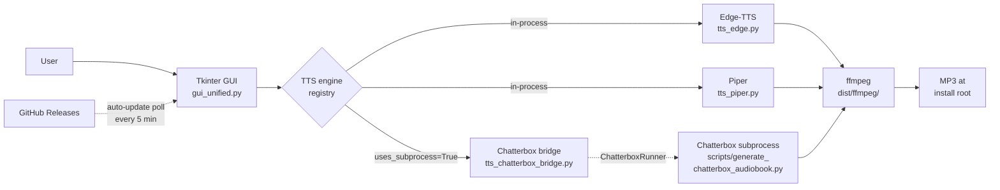
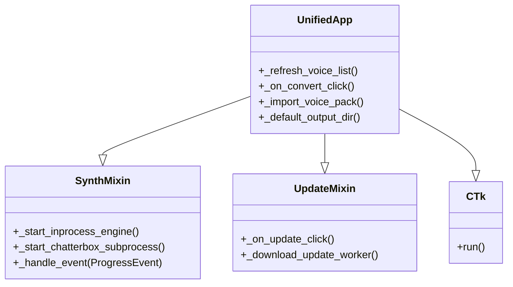
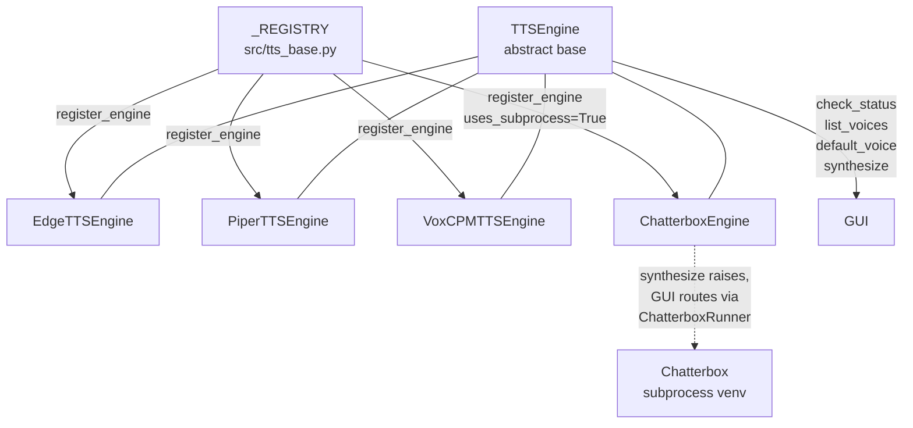
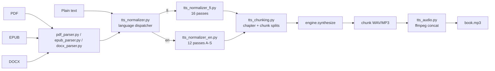
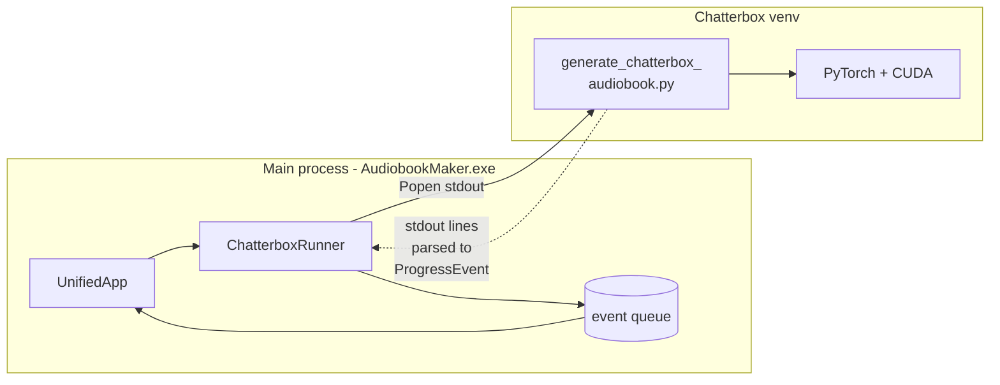
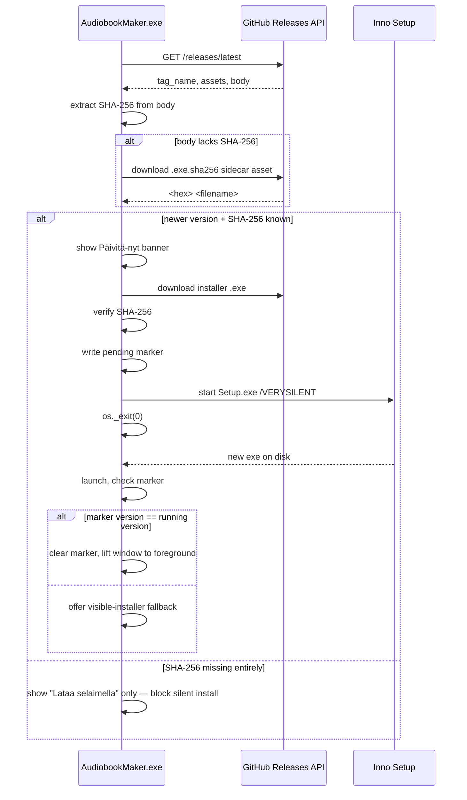
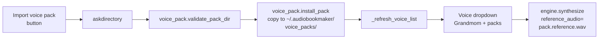

# Architecture

A reading guide to how AudiobookMaker fits together. Read this once at
the start of a session and you won't have to re-grep for where things
live.

## Bird's-eye view


```mermaid
flowchart LR
    User[User] --> GUI[Tkinter GUI<br/>gui_unified.py]
    GUI --> Engines{TTS engine<br/>registry}
    Engines -->|in-process| Edge[Edge-TTS<br/>tts_edge.py]
    Engines -->|in-process| Piper[Piper<br/>tts_piper.py]
    Engines -->|uses_subprocess=True| CBB[Chatterbox bridge<br/>tts_chatterbox_bridge.py]
    CBB -.->|ChatterboxRunner| CB[Chatterbox subprocess<br/>scripts/generate_<br/>chatterbox_audiobook.py]
    Edge --> FF[ffmpeg<br/>dist/ffmpeg/]
    Piper --> FF
    CB --> FF
    FF --> MP3[MP3 at<br/>install root]
    GU[GitHub Releases] -.->|auto-update poll<br/>every 5 min| GUI
```

The GUI is a single Tk window. It hands off the text + voice choice to
one of the TTS engines registered in `_REGISTRY`. Edge-TTS and Piper
run in-process; Chatterbox is registered through a metadata-only
bridge class whose `uses_subprocess = True` flag tells the dispatcher
to route work to a separate Python 3.11 venv (heavy ML deps). All
engines write chunks that ffmpeg stitches into a final MP3 stored next
to `AudiobookMaker.exe`.

## GUI layer

`src/gui_unified.py` defines `UnifiedApp`, which inherits from two
mixins plus `customtkinter.CTk`:


```mermaid
classDiagram
    class CTk { +run() }
    class SynthMixin {
      +_start_inprocess_engine()
      +_start_chatterbox_subprocess()
      +_handle_event(ProgressEvent)
    }
    class UpdateMixin {
      +_on_update_click()
      +_download_update_worker()
    }
    class UnifiedApp {
      +_refresh_voice_list()
      +_on_convert_click()
      +_import_voice_pack()
      +_default_output_dir()
    }
    UnifiedApp --|> SynthMixin
    UnifiedApp --|> UpdateMixin
    UnifiedApp --|> CTk
```

Why mixins: orchestration (synthesis pump, update banner) is stateful
and ~500 lines each — keeping them on the main class would bloat
`gui_unified.py` past readable. Mixins use `typing.Protocol` to declare
the attributes they expect the host to provide, so type-checking still
works.

Widget-composition lives in `src/gui_builders/` — one file per major
section of the window (`header_bar.py`, `engine_bar.py`,
`settings_frame.py`, `action_row.py`). Each builder takes the
`UnifiedApp` host plus parent frame + row and writes widget attributes
back onto the host, so the rest of the app keeps its existing
attribute interface. Builders contain only layout — no business logic.

Further extracted pieces:
- `src/gui_builders/` — per-section widget builders (header, engine bar,
  settings frame, action row)
- `src/gui_engine_dialog.py` — "Asenna moottoreita…" modal view
- `src/gui_style.py` — Cold Forge design-system tokens (fonts, spacing,
  colours, icons) loaded from `assets/design_system.json`
- `src/gui_synth_mixin.py` — synthesis orchestration
- `src/gui_update_mixin.py` — auto-update banner + download
- `src/synthesis_orchestrator.py` — input → output routing helpers
  (path suggestion, book parsing, in-process synthesis request runner)
- `src/engine_registry.py` — single import point that registers every
  in-tree engine (developer-only VoxCPM2 is guarded here)

## TTS engine registry

All engines plug into a single registry in `src/tts_base.py`:


```mermaid
flowchart TD
    R[_REGISTRY<br/>src/tts_base.py] -->|register_engine| E[EdgeTTSEngine]
    R -->|register_engine| P[PiperTTSEngine]
    R -->|register_engine| V[VoxCPMTTSEngine]
    R -->|register_engine<br/>uses_subprocess=True| C[ChatterboxEngine]
    Base[TTSEngine<br/>abstract base] --- E
    Base --- P
    Base --- V
    Base --- C
    Base -->|check_status<br/>list_voices<br/>default_voice<br/>synthesize| GUI
    C -.->|synthesize raises,<br/>GUI routes via<br/>ChatterboxRunner| SUB[Chatterbox<br/>subprocess venv]
```

Each engine implements four methods:

| Method | Purpose |
|--------|---------|
| `check_status()` | Is this engine installed + ready? Returns `EngineStatus` |
| `list_voices(lang)` | Voices available for a given language |
| `default_voice(lang)` | Opinionated default per language |
| `synthesize(text, voice_id, out_path, rate=, voice_description=, …)` | Do the work |

The `synthesize()` contract grew two optional parameters during the
CLI-parity audit work:

- `rate` — edge-tts-style speed string (`"-25%"`, `"+0%"`, `"+25%"`,
  `"+50%"`). Engines without rate control must silently ignore it.
- `voice_description` — free-text voice prompt for engines that accept
  one (e.g. VoxCPM2). Engines without support silently ignore it.

Engines also advertise a class flag `supports_per_chapter: bool` so
the GUI and CLI can refuse "per-chapter output" up front for engines
that don't support it. Only Edge-TTS overrides this to `True` today.

Chatterbox plugs into the same registry as everything else through
`src/tts_chatterbox_bridge.py`, which sets the `uses_subprocess = True`
class flag. The GUI dispatcher checks that flag and routes synthesis
through `ChatterboxRunner` (`src/launcher_bridge.py`) instead of
calling `synthesize()` in-process — Chatterbox's `synthesize()`
deliberately raises so any caller that forgets the check fails loudly.
The subprocess is a separate Python 3.11 venv because Chatterbox needs
PyTorch + CUDA + a 7 GB model, all kept out of the main app bundle so
it stays ~200 MB.

## Text pipeline


```mermaid
flowchart LR
    PDF[PDF] --> Parsers[pdf_parser.py / epub_parser.py / docx_parser.py]
    EPUB[EPUB] --> Parsers
    DOCX[DOCX] --> Parsers
    Text[Plain text] --> Disp
    Parsers --> Disp[tts_normalizer.py<br/>language dispatcher]
    Disp -->|fi| Fi[tts_normalizer_fi.py<br/>16 passes]
    Disp -->|en| En[tts_normalizer_en.py<br/>12 passes A-S]
    Fi --> Chunker[tts_chunking.py<br/>chapter + chunk splits]
    En --> Chunker
    Chunker --> Engine[engine.synthesize]
    Engine --> Wav[chunk WAV/MP3]
    Wav --> Audio[tts_audio.py<br/>ffmpeg concat]
    Audio --> Final[book.mp3]
```

- `pdf_parser.py` — PyMuPDF, extracts chapters heuristically
- `epub_parser.py` — EPUB chapter extraction (same output shape as `pdf_parser`)
- `docx_parser.py` — DOCX chapter extraction via the stdlib (`zipfile` +
  `xml.etree`); same output shape as `pdf_parser`, no third-party dependency
- `tts_normalizer.py` — language dispatcher. `normalize_text(text, lang)`
  routes to the per-language module; lazy-imports it so the unused side
  stays out of memory. Supported codes: `"fi"`, `"en"`. Unknown codes
  raise `ValueError`.
- `tts_normalizer_fi.py` — 16 transformation passes that make Finnish
  abbreviations, numbers, case endings, and dates readable. Runs before
  chunking so the chunker splits on fully expanded sentences. Covered by
  150+ unit tests; see [`tts_text_normalization_cases.md`](tts_text_normalization_cases.md)
- `tts_normalizer_en.py` — 12 English passes covering Roman numerals,
  abbreviations, dates, currency, units, time, telephone, URLs/emails,
  acronyms. Heavy passes O/P/R/S live in standalone `src/_en_pass_*.py`
  modules so they unit-test in isolation.
- `tts_chunking.py` — splits long text at sentence boundaries under a
  length cap the engine can handle
- `tts_audio.py` — thin wrapper around `pydub` + bundled ffmpeg

## Engine bar (Phase 2 — language-first)

The main window's engine bar is one row of three connected dropdowns:
**Language → Engine → Voice**. Picking a Language filters the Engine
dropdown to engines whose `supported_languages()` includes it; picking
an Engine filters the Voice dropdown via `engine.list_voices(language)`.

Three action buttons sit next to the dropdowns:
- **Convert** — full book to one or many MP3s (depending on the
  Output mode in Settings).
- **Make Sample** — synthesize the first ~30 s (~500 chars trimmed at
  a sentence boundary) of the input to `<book>_sample.mp3` next to the
  planned full-run target. For Chatterbox the sample is renamed out
  of the runner's nested folder by `_finalize_chatterbox_output_if_needed`.
- **Preview** — plays the most recent finished MP3 from the session via
  the OS player. Falls back to a quick text-only synthesis when no MP3
  exists yet.

Engine-bar callbacks (`_on_language_changed`, `_on_engine_changed`)
are wired AFTER `_apply_loaded_config()` runs, so loading saved
preferences during init never triggers the cascade.

## CLI layer

The CLI (`src/cli/`) is a thin presentation layer over the same backend
modules the GUI uses: `synthesis_orchestrator`, `engine_registry`,
`voice_pack`, `app_config`, `auto_updater`, `system_checks`. There is no
CLI-only synthesis logic — if the GUI fixes a bug, the CLI picks it up
automatically.

```
src/cli/
  __main__.py       entry point; dispatches subcommands; sets up logging
  _common.py        exit codes, shared flags, stdin materialization,
                    rate sanitiser, ProgressEvent printer
  convert.py        wraps run_inprocess_synthesis / ChatterboxRunner
  sample.py         wraps sample_helpers + convert.run()
  preview.py        wraps engine.synthesize + _audio_player
  voices.py         reads engine_registry.list_voices
  engines.py        wraps src/engine_installer.py
  packs.py          wraps src/voice_pack/
  config.py         wraps src/app_config.py
  update.py         wraps src/auto_updater.py
  doctor.py         wraps src/system_checks.py + ffmpeg_path
  report_bug.py     wraps src/bug_report.build_bug_report_url
```

### Subcommand registration

Each leaf module exposes `add_parser(subparsers)` and stores `run` as
the subparser's `func` default, so `__main__.main()` only needs to call
`args.func(args)`. Subcommand aliases (`c` for `convert`, `s` for
`sample`, `p` for `preview`) are declared via the public argparse
`aliases=` parameter on each `add_parser()` call — no private-API
manipulation. The `scripts/render_cli_help.py` renderer dedupes aliased
parsers by `id()` so `docs/CLI.md` doesn't get duplicate sections.

### Stdin materialization

A `-` in place of the INPUT positional means "read stdin". Binary
inputs (`pdf`/`epub`/`docx`) also require `--input-format` because stdin
carries no extension. `_common.materialize_stdin_to_tempfile(fmt)` does
the actual `sys.stdin.buffer.read()` into `.local/scratch/stdin_<8hex>.<ext>`
and `cleanup_stdin_tempfile(path)` deletes it in a `try/finally` so the
tempfile is gone whether synthesis succeeded, failed, or raised.

### Per-chapter output dispatch

`--output-mode per-chapter` flows through `InprocessRequest.output_mode`
into `run_inprocess_synthesis`, which branches between a single-file
loop and a per-chapter loop that emits `chapter_done` events per file
and a terminal `done` event with the output **directory**. The CLI
rejects `--output-mode per-chapter` at the engine-capability check
(`engine.supports_per_chapter`) before any heavy load, so non-Edge-TTS
engines fail fast with `EXIT_BAD_INPUT` instead of mid-synthesis.

### Config precedence

For every synthesis flag (`--engine`, `--language`, `--voice`,
`--output`, `--speed`, `--voice-description`, `--output-mode`):

```
CLI flag  >  AUDIOBOOKMAKER_*  env var  >  ~/.audiobookmaker/config.json  >  built-in default
```

`_common.resolve_str` is the central resolver. `_common.sanitize_rate`
guards the speed-rate field specifically: a corrupt config can't smuggle
"bogus" into the engine — anything not matching `[+-]?\d+%` is rewritten
to `"+0%"` with a one-line stderr breadcrumb.

### JSON output

Synthesis commands (`convert`, `sample`, `preview`) emit one
ProgressEvent per line (NDJSON) with kinds `log`, `chunk`,
`chapter_start`, `chapter_done`, `full_done`, `done`, `skipped`,
`error`, `exit`. List commands (`voices list`, `engines list`,
`packs list`) emit one domain object per line in a subcommand-specific
shape — each leaf's `--help` documents its own JSON shape.

### Confirmation prompts and destructive flags

`packs remove`, `engines remove`, `update apply` all share two rules:

1. `--yes` is the only flag that bypasses the interactive prompt; cosmetic
   flags (`--quiet`) must not change destructive behaviour.
2. Prompt text routes to **stderr**, not stdout, so a user piping the
   output (`packs remove SLUG | jq`) doesn't see the prompt leak into
   the consumer.

## Subprocess & cross-process messaging

Chatterbox synthesis is a separate process. The GUI talks to it via
`src/launcher_bridge.py`:


```mermaid
flowchart LR
    subgraph Main[Main process - AudiobookMaker.exe]
      App[UnifiedApp]
      Runner[ChatterboxRunner]
      Queue[(event queue)]
      App --> Runner
      Runner --> Queue
      Queue --> App
    end
    subgraph CB[Chatterbox venv]
      Script[generate_chatterbox_<br/>audiobook.py]
      Model[PyTorch + CUDA]
      Script --> Model
    end
    Runner -->|Popen stdout| Script
    Script -.->|stdout lines<br/>parsed to<br/>ProgressEvent| Runner
```

The subprocess emits structured lines on stdout. `ChatterboxLineParser`
in `launcher_bridge.py` turns them into `ProgressEvent` dataclasses
(chunk/chapter/setup/exit). A reader thread pumps them into a
`queue.Queue` that the GUI drains on its Tk `after()` timer. Backpressure
is handled by the queue; cancellation flows the other way via
`threading.Event`.

### Engine venv integrity (the v3.16–v3.17.3 hardening)

Field failures where install/repair reported success while Convert kept
failing produced a set of invariants, each enforced by tests:

- **One verification path.** The installer's post-install smoke test
  runs the runner script's `--selftest` (`engine_installer.RUNNER_SCRIPT_PATH`)
  — the same file, imports, and environment as a real synthesis — with
  an inline `python -c` probe only as a fallback. Smoke and Convert
  can therefore never verify different things.
- **Environment isolation.** Both the runner spawn and the smoke test
  use `launcher_bridge.isolated_python_env()` (strips
  `PYTHONPATH`/`PYTHONHOME`/`PYTHONSTARTUP`, sets `PYTHONNOUSERSITE`),
  so the venv interpreter can't be redirected to the app's bundled
  packages. The runner *appends* (never prepends) its root to
  `sys.path` for the same reason — a source-guard test enforces it.
- **Provenance.** Every run prints a `[runner] build` stamp; the GUI
  logs `Runner:`/`Venv:` lines before starting. A stale script (e.g. a
  half-applied silent update) or a stray venv is visible in any user
  log instead of requiring a multi-day investigation.
- **Install lifecycle marker.** The venv carries `.install-incomplete`
  from creation until smoke passes; while present the engine reads as
  not-installed, so Convert can't run against (and corrupt) a
  half-built venv.
- **Repair semantics.** Repair force-reinstalls the pinned package set
  with `--no-deps` (so chatterbox's torch dependency can't clobber the
  cu124 CUDA wheel with a CPU build), reinstalls torch in place when a
  non-CUDA build is detected, and escalates to a clean rebuild only on
  corruption-shaped smoke failures (`_CORRUPTION_SMOKE_SIGNATURES`) —
  never on environmental ones like a missing NVIDIA driver.

Diagnosis runbook for field reports: the `engine-venv-triage` skill.

## Auto-update


```mermaid
sequenceDiagram
    participant App as AudiobookMaker.exe
    participant GH as GitHub Releases API
    participant Inno as Inno Setup
    App->>GH: GET /releases/latest
    GH-->>App: tag_name, assets, body
    App->>App: extract SHA-256 from body
    alt body lacks SHA-256
      App->>GH: download .exe.sha256 sidecar asset
      GH-->>App: <hex>  <filename>
    end
    alt newer version + SHA-256 known
      App->>App: show Päivitä-nyt banner
      App->>GH: download installer .exe
      App->>App: verify SHA-256
      App->>App: write pending marker
      App->>Inno: start Setup.exe /VERYSILENT
      App->>App: os._exit(0)
      Inno-->>App: new exe on disk
      App->>App: launch, check marker
      alt marker version == running version
        App->>App: clear marker, lift window to foreground
      else
        App->>App: offer visible-installer fallback
      end
    else SHA-256 missing entirely
      App->>App: show "Lataa selaimella" only — block silent install
    end
```

- `src/auto_updater.py` — GitHub API polling, SHA-256 from body OR
  `.exe.sha256` sidecar asset, download, integrity check, pending-marker
  lifecycle, installer invocation, post-update foreground pop.
- `installer/setup.iss` — Inno Setup script. PrivilegesRequired=lowest
  (installs to `%LOCALAPPDATA%\Programs\AudiobookMaker`). Registry-based
  auto-uninstall of any prior version before installing.
- `.github/workflows/build-release.yml` — on tag push (`v*`), builds the
  PyInstaller bundle on a Windows runner, wraps in Inno Setup, uploads
  the installer + a sidecar `.exe.sha256` text file, auto-injects the
  SHA-256 into the release notes, and post-publish-verifies that a hash
  is recoverable. Auto-update is treated as P0 — see `docs/CONVENTIONS.md`
  for the mandatory release guarantees.

Version numbering: `APP_VERSION` in `src/auto_updater.py` is the source
of truth. CI rewrites it from the git tag at build time, so dev-mode
runs use the committed value (useful for local testing).

## Voice packs

Voice packs are imported bundles of voice artefacts (reference audio,
LoRA adapter weights, and metadata) that surface as extra entries in
the Voice dropdown alongside the built-in Grandmom. The on-disk format
and the GUI Import flow live in `src/voice_pack/`.


```mermaid
flowchart LR
    Pick[Import voice pack<br/>button] --> Dlg[askdirectory]
    Dlg --> Validate[voice_pack.validate_pack_dir]
    Validate --> Install[voice_pack.install_pack<br/>copy to ~/.audiobookmaker/<br/>voice_packs/]
    Install --> Refresh[_refresh_voice_list]
    Refresh --> Drop[Voice dropdown<br/>Grandmom + packs]
    Drop --> Synth[engine.synthesize<br/>reference_audio=<br/>pack.reference.wav]
```

- Pack directory layout: `meta.yaml` (name, language, tier), `sample.wav`,
  and either `reference.wav` (few-shot tier) or `adapter.pt` (LoRA tier).
- Packs show up in the Voice dropdown only when the active engine is
  Chatterbox — the clone-by-reference code path is how they steer
  synthesis today. Picking a pack auto-populates reference audio from
  the pack's `reference.wav` (few-shot) or falls back to `sample.wav`.
  An explicit user entry in Ref. ääni always wins.
- Pipeline scripts (`voice_pack_analyze`, `voice_pack_bucket`,
  `voice_pack_train`, `voice_pack_package`) build packs from source
  recordings; they live under `scripts/` and run in an isolated venv
  because of heavy ML deps.

## Cleanup of old installs

`src/cleanup.py` runs silently on startup. Scans known install paths
(AppData, Program Files, `C:\AudiobookMaker`, `D:\AudiobookMaker`,
`D:\koodaamista\AudiobookMakerApp`) and orphan Start-Menu / desktop /
taskbar shortcuts. For each old install:

1. Rescues any user MP3s (root or legacy `audiobooks/` subfolder) into
   the current install's output dir
2. Runs `unins000.exe /VERYSILENT` if available
3. Falls back to `shutil.rmtree`

Users never lose audiobooks to cleanup.

## File layout reference

```
src/
  main.py                    # entry point, single-instance guard
  gui_unified.py             # UnifiedApp, i18n strings, banner, widgets
  gui_builders/              # per-section widget builders
    header_bar.py            #   logo + title + update banner
    engine_bar.py            #   Language / Engine / Voice dropdowns
    settings_frame.py        #   collapsible Settings panel
    action_row.py            #   Convert + Sample + Preview + progress
  gui_style.py               # Cold Forge design tokens (fonts, colours)
  gui_synth_mixin.py         # synthesis orchestration
  gui_update_mixin.py        # auto-update banner + download
  gui_engine_dialog.py       # engine install/manage modal view
  synthesis_orchestrator.py  # input → output routing (parse + dispatch)
  engine_registry.py         # single import point for in-tree engines
  auto_updater.py            # GitHub polling, download, apply_update()
  cleanup.py                 # old-install detection + MP3 rescue
  single_instance.py         # mutex against multiple app copies
  launcher_bridge.py         # ChatterboxRunner + ProgressEvent
  engine_installer.py        # in-app Chatterbox installer
  system_checks.py           # GPU, disk, Python 3.11 detection
  ffmpeg_path.py             # bundled-ffmpeg PATH wiring + pydub patching
  tts_base.py                # TTSEngine ABC + _REGISTRY
  tts_edge.py                # Edge-TTS adapter
  tts_piper.py               # Piper adapter
  tts_voxcpm.py              # VoxCPM2 adapter (dev only)
  tts_chatterbox_bridge.py   # Chatterbox registration (uses_subprocess)
  tts_chunking.py            # sentence-aware text splitting
  tts_normalizer.py          # language dispatcher (fi / en routing)
  tts_normalizer_fi.py       # Finnish text → speakable form (16 passes)
  tts_normalizer_en.py       # English text → speakable form (12 passes A-S)
  _en_pass_o_dates.py        # English Pass O (dates) helper module
  _en_pass_p_telephone.py    # English Pass P (telephone numbers) helper
  _en_pass_r_urls.py         # English Pass R (URLs / emails) helper
  _en_pass_s_acronyms.py     # English Pass S (acronyms) helper
  _yaml_data.py              # pure-Python fallback for PyYAML-less builds
  tts_audio.py               # pydub/ffmpeg wrappers
  tts_engine.py              # TTSConfig + chapters_to_speech pipeline
  pdf_parser.py              # PyMuPDF chapter extraction
  epub_parser.py             # EPUB chapter extraction (same shape as pdf_parser)
  docx_parser.py             # DOCX chapter extraction, stdlib-only (same shape)
  fi_loanwords.py            # loanword respelling lookup
  sample_helpers.py          # extract_sample_text + sample output path helpers
  duration_estimate.py       # pre-synthesis ETA estimate
  app_config.py              # settings persistence + system-locale defaults
  voice_recorder.py          # in-app mic capture for cloning
  voice_pack/                # voice pack pipeline + artefact format
    pack.py                  #   install_pack / list_packs / VoicePack
    types.py                 #   dataclasses (AsrSegment, DiarTurn, …)
    analyze.py               #   (via scripts/) ASR + quality scoring
    diarize.py               #   speaker diarization helper
    align.py                 #   forced alignment against supplied text
    asr.py                   #   faster-whisper wrapper
    bucket.py                #   per-speaker segment bucketing
    dataset.py               #   training-dataset manifest builder
    emotion.py               #   per-segment emotion tagging
    expression.py            #   ExpressionPlan markup parser

scripts/
  generate_chatterbox_audiobook.py  # runs in the Chatterbox venv
  voice_pack_analyze.py             # build analysis JSON from source audio
  voice_pack_bucket.py              # per-speaker clip bucketing
  voice_pack_train.py               # (seam) LoRA fine-tune loop
  voice_pack_package.py             # assemble meta.yaml + artefacts

installer/
  setup.iss                  # Inno Setup script

audiobookmaker.spec          # PyInstaller spec (main app bundle)
```

## Legacy modules

Two earlier entry points are still on disk but are no longer the surface
new work should touch:

- `src/gui.py` — the original advanced-mode Tkinter window. Predates
  `gui_unified.py` and has hardcoded Finnish literals instead of the
  `_STRINGS` table. Kept so older build paths and any external callers
  that still import `src.gui` do not break.
The legacy `src/launcher.py` minimal launcher and its separate build
(`audiobookmaker_launcher.spec`, `installer/launcher.iss`,
`.github/workflows/build-launcher.yml`) were **retired on 2026-06-22** — the
unified app fully replaces them, and the second installer was the structural
cause of "the GUI sounds worse than dev" (it launched the Chatterbox runner
without `--voice-pack`/`--language`, silently dropping imported voice packs).
`installer/post_install_chatterbox.py` was kept — the in-app "Install engines"
flow shells out to it and its parity tests depend on it.
`installer/ensure_python311.ps1` was orphaned by the retirement (only the
Launcher installer ran it; the in-app install uses
`engine_installer._ensure_python311`) and removed too.

`src/gui.py` carries a header docstring marking it legacy. Extend
`src/gui_unified.py` instead — it exists only for backward compatibility.

## Updating this document

When you change any of these boundaries — a new engine, a new mixin, a
new subprocess, a change in how the updater decides things — update the
matching Mermaid block and the relevant prose paragraph in the same
commit. The doc loses its value if it drifts.
