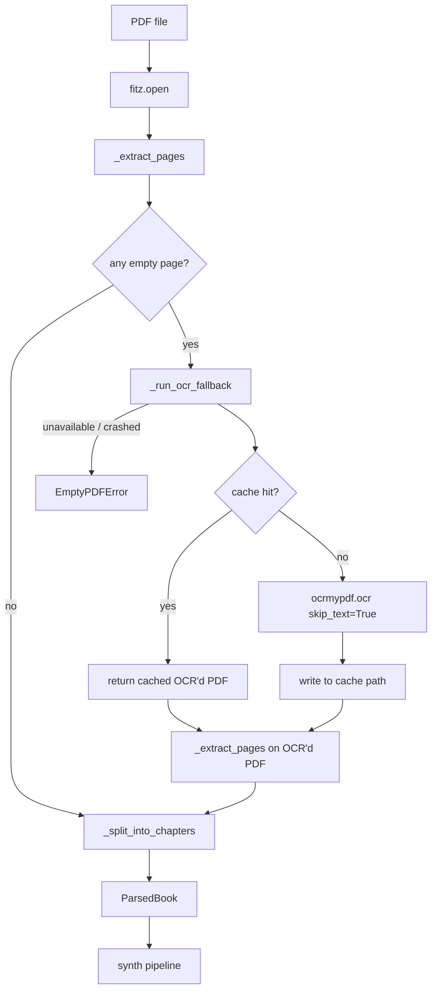

# OCR fallback for scanned PDFs

> **Operational runbook:** for the step-by-step "user handed me a scanned PDF, how do I turn it into an audiobook" flow, see the
> [`scanned-pdf-to-audiobook`](../.claude/skills/scanned-pdf-to-audiobook/SKILL.md)
> skill. This document is the architectural side of the same feature — what
> the code does and why; the skill is what to actually run.

## 1. What this feature does

Scanned PDFs used to dead-end the Convert path. PyMuPDF would extract zero
text, the parser would raise `EmptyPDFError`, and the user got "the file
may be scanned — try OCR first" with no path forward. Now, when any page
of a PDF returns empty text, the parser automatically runs
[ocrmypdf](https://ocrmypdf.readthedocs.io/) over the whole document
(which itself wraps Tesseract + Ghostscript), re-opens the resulting
text-bearing PDF, re-extracts, and feeds the text into the rest of the
synthesis pipeline. The OCR'd PDF is cached on disk keyed by source-file
SHA-256, so a second run over the same input skips Tesseract entirely.
Text-bearing PDFs are unaffected — the trigger only fires when PyMuPDF
gives up on at least one page.

## 2. When it fires

The trigger contract is per-page-empty, document-wide-OCR. Inside
[_extract_pages](../src/pdf_parser.py#L282) every page is asked for text;
pages that return an empty string after `.strip()` are counted but not
added to `pages_text`. If that counter is non-zero,
[parse_pdf](../src/pdf_parser.py#L378) calls
[_run_ocr_fallback](../src/pdf_parser.py#L324) on the original file.

`_run_ocr_fallback` invokes `ocrmypdf.ocr(..., skip_text=True)`. The
`--skip-text` mode is important: pages that already carry a text layer
are left untouched, only the image-only pages get OCR'd. So a mixed PDF
(text body with a cover image, or a few scanned inserts in an otherwise
born-digital book) gets the right treatment — the OCR'd output keeps the
original embedded text and only adds a new text layer where one was
missing. After OCR succeeds, `_extract_pages` runs a second time against
the OCR'd PDF, replacing the earlier (incomplete) `pages_text` list
before chapter splitting.

If the parser still finds zero total characters after the fallback,
`EmptyPDFError` fires with the same "may be scanned" message — that path
is now only reachable when OCR was unavailable or failed.

## 3. Pipeline diagram

## 4. Code map

| Concept | File | Function |
|---|---|---|
| Per-page extract + empty count | [pdf_parser.py](../src/pdf_parser.py#L282) | `_extract_pages` |
| Trigger decision | [pdf_parser.py](../src/pdf_parser.py#L422) | `parse_pdf` |
| OCR runner (ocrmypdf wrapper) | [pdf_parser.py](../src/pdf_parser.py#L324) | `_run_ocr_fallback` |
| Cache key (sha256 of bytes) | [pdf_parser.py](../src/pdf_parser.py#L300) | `_sha256_file` |
| Cache path resolver | [pdf_parser.py](../src/pdf_parser.py#L311) | `_ocr_cache_path` |
| Tooling availability check | [ocr_path.py](../src/ocr_path.py#L108) | `is_ocr_available` |
| PATH + TESSDATA_PREFIX export | [ocr_path.py](../src/ocr_path.py#L123) | `setup_ocr_path` |
| Bundled-binary search order | [ocr_path.py](../src/ocr_path.py#L29) | `_candidate_dirs` |
| TTS-lang -> Tesseract-lang map | [ocr_path.py](../src/ocr_path.py#L103) | `tesseract_lang_for` |
| Convert path (GUI) caller | [gui_unified.py](../src/gui_unified.py#L1433) | `_get_input_text` |
| Launcher subprocess caller | [launcher.py](../src/launcher.py#L426) | `_run_inprocess` |
| Dispatcher signature | [synthesis_orchestrator.py](../src/synthesis_orchestrator.py#L45) | `parse_book` |
| PATH setup at boot | [main.py](../src/main.py#L39) | `main` |
| Bundle wiring | [audiobookmaker.spec](../audiobookmaker.spec#L241) | `_OCR_SRC` block |
| Tests | [tests/test_ocr_fallback.py](../tests/test_ocr_fallback.py) | `TestOCRTriggering` et al |

## 5. Caching strategy

OCR is slow (Tesseract runs on every image-only page; ~25 s for a 32-page
document on a developer laptop). Caching turns the second run over the
same source into a near-instant operation.

The cache key is `sha256(source_pdf_bytes)`. Same bytes -> same key, so
a renamed copy of the same PDF hits the cache. Any byte change (re-export
from the source app, a page added, annotations stamped on) misses and
re-OCRs. Filename and mtime are deliberately not part of the key.

Two storage modes:

- **`ocr_cache_dir` passed in:** the OCR'd PDF lives at
  `<cache_dir>/<sha256>.pdf` and survives across sessions. The directory
  is created on demand. No GUI surface today plumbs a cache directory
  in — the parameter exists so a future "Settings -> OCR cache" knob can
  add one without a parser change.
- **`ocr_cache_dir` omitted (today's default):** the OCR'd PDF lands in
  the OS temp dir as `audiobookmaker_ocr_<first16hex>.pdf`. Same-session
  de-dupe works; survival across reboots is at the OS's discretion (most
  Windows installs sweep temp dirs occasionally).

There is no eviction logic. Deleting the cache file or the cache
directory simply forces the next run to re-OCR — safe at any time.

## 6. Failure modes and graceful degradation

OCR is opportunistic. Every failure mode falls back to the pre-OCR
behaviour: `EmptyPDFError` with the "may be scanned — try OCR first"
message. The app never crashes because OCR was missing or broken.

| Symptom | Detection | What the user sees |
|---|---|---|
| `ocrmypdf` not installed (dev machine, requirements not synced) | `is_ocr_available()` returns `False` because `import ocrmypdf` raises `ImportError` | `EmptyPDFError` on scanned input; text-bearing PDFs unaffected |
| Tesseract or Ghostscript binary missing (frozen build without OCR bundle, or PATH without choco/winget install) | `is_ocr_available()` returns `False` because `get_tesseract_exe()` / `get_ghostscript_exe()` return `None` | Same as above |
| `ocrmypdf.ocr()` crashes mid-run (corrupt PDF, missing `tessdata/configs/`, image preprocessing fails) | Exception caught at [pdf_parser.py:368](../src/pdf_parser.py#L368); partial output file deleted; warning logged | `EmptyPDFError` on the original input; cache stays clean so a retry is honest |

The exception handler at the bottom of `_run_ocr_fallback` deletes the
partial OCR PDF on failure. Without that, a crashed run would leave a
zero-byte or truncated PDF at the cache path, and the next attempt would
treat that broken file as a cache hit and skip OCR forever.

## 7. Frozen vs dev mode

The frozen `.exe` and the dev tree expect Tesseract + Ghostscript in
different places. [_candidate_dirs](../src/ocr_path.py#L29) encodes the
search order:

1. `sys._MEIPASS` when running from a PyInstaller one-folder build
   (binaries copied to the package root next to `ffmpeg.exe`)
2. `Path(sys.executable).parent` — the install root, same place
   `ffmpeg.exe` lands
3. `<repo>/dist/ocr/` — the dev-mode staging dir, populated either by CI
   or by a developer who manually mirrored the CI step
4. `<repo>/../` — parent-of-repo, kept for parity with `ffmpeg_path` to
   support the Chatterbox subprocess case
5. Whatever `shutil.which("tesseract" / "gswin64c.exe")` resolves to —
   the user's PATH, populated by `winget install UB-Mannheim.TesseractOCR`
   + `winget install ArtifexSoftware.GhostScript` on dev boxes

Frozen builds ship `tesseract.exe` + DLLs + `tessdata/*.traineddata` +
`tessdata/configs/` + `gswin64c.exe` + `gsdll64.dll` next to the install
root. Dev installs that want to test OCR need to either drop those files
under `dist/ocr/` or `winget install` the equivalent system packages.

## 8. Build and CI

The "Bundle Tesseract + Ghostscript for OCR fallback" step in
[build-release.yml](../.github/workflows/build-release.yml#L99) stages
`dist/ocr/` before PyInstaller runs:

- **Tesseract binary + DLLs + `configs/`:** installed via
  `choco install tesseract`. Chocolatey is preinstalled on GHA Windows
  runners. The choco package drops everything under
  `C:\Program Files\Tesseract-OCR`; the step copies the exe, every DLL,
  and the `tessdata/configs/` subdirectory.
- **Trained data (`eng.traineddata`, `fin.traineddata`):** pulled from
  the [tessdata_fast](https://github.com/tesseract-ocr/tessdata_fast)
  GitHub repo at the **4.1.0 tag** (the latest tagged release as of
  2026-05-12 — that repo's release cadence tracks Tesseract major
  bumps, so a re-check is overdue only when a new Tesseract major lands).
  Both files are SHA-256-verified inline against pinned hashes in the
  step's `env:` block, matching the shape of the ffmpeg pin in the
  step above.
- **Ghostscript:** installed via `choco install ghostscript`. The step
  globs the version-prefixed install dir (`/c/Program Files/gs/gs*/bin`)
  so a Ghostscript point release doesn't break the copy.

The spec block ([audiobookmaker.spec:241](../audiobookmaker.spec#L241))
is conditional on `dist/ocr/` existing. If a developer runs `pyinstaller`
locally without populating that dir, the build still succeeds — the
frozen exe simply ships without OCR support and the runtime falls back
to "no OCR available" mode. CI populates the dir on `push` events
(tagged releases); pull-request builds skip the step intentionally to
keep PR builds fast.

The `tessdata/configs/` subdirectory is non-obvious but load-bearing.
Without it, ocrmypdf reaches 100% then crashes trying to parse empty
`.hocr` output. The PR #26 smoke test caught this against a 32-page
scanned document; the fix is one extra `glob` loop at
[audiobookmaker.spec:259](../audiobookmaker.spec#L259).

## 9. GUI surface

There is no new control. OCR happens transparently inside the existing
Convert path. The language passed to Tesseract is derived from the TTS
book Language picker — Finnish-selected -> `fin.traineddata`,
English-selected -> `eng.traineddata`, anything else -> `eng` as the
safe default ([ocr_path.py:103](../src/ocr_path.py#L103)).

This is a deliberate Phase 1 design. An explicit OCR-language override
would invite the user to mismatch it against the TTS Voice picker, which
breaks chapter detection (a Finnish book OCR'd as English produces
diacritic-stripped text that the heading regexes miss). When a real use
case shows up — bilingual sources, scanned with embedded English
headings — a separate combobox can join the Language strip without
touching the parser API.

## 10. Performance characteristics

- **Text-bearing PDF:** zero overhead. The `empty_pages` counter stays
  at zero, no fallback called.
- **Cold OCR run, 32-page scanned PDF on a dev laptop:** ~25 seconds
  (PR #26 smoke test). Most of that is Tesseract; ocrmypdf's overhead
  on top is small.
- **Cache hit:** under 100 ms. PyMuPDF reopens the cached OCR'd PDF and
  extracts text the same way it would for any born-digital PDF.
- **Mixed PDF (cover image + text body):** ocrmypdf only OCRs the
  image-only pages thanks to `skip_text=True`, so wall time scales with
  the count of scanned pages, not document length.

The Convert button does not advertise OCR progress today. The status
strip says "Parsing..." for the full duration of `parse_book`, which
covers the OCR pass. A future enhancement could surface an "OCR'ing
scanned pages..." sub-state, but only the Convert path runs this — the
sticky-strip estimate at file-pick time uses the same `parse_book` call
but on a worker thread, so the UI stays responsive even when OCR is
slow.

## 11. Known deferred work

These are intentional Phase 1 omissions. They are listed here so future
sessions don't try to "fix" them again without context.

- **Preview / estimate / Listen paths skip OCR.** The auto-estimate
  worker at [gui_unified.py:1718](../src/gui_unified.py#L1718), the
  Listen sample-extract path at
  [gui_unified.py:2628](../src/gui_unified.py#L2628), and the disk-space
  estimate at [gui_unified.py:2747](../src/gui_unified.py#L2747) all
  call `parse_book(path)` without `ocr_language=`. They will hit
  `EmptyPDFError` on a scanned PDF and the worker swallows the error
  silently. Threading OCR through these paths means a multi-second
  block on file-pick — not the right trade for an estimate. The Convert
  path is the one place where the user has already committed to waiting,
  so it's the one place that runs OCR.
- **Launcher hardcodes `ocr_language="fin"`** at
  [launcher.py:426](../src/launcher.py#L426). The launcher only ships
  the Finnish voice path today, so the hardcode is correct. When (if)
  the launcher gains a language picker, route through
  `ocr_path.tesseract_lang_for` instead.
- **No OCR-confidence filtering.** Tesseract emits confidence scores
  per word; we currently use every word it emits. If real-world OCR
  garbage starts producing false chapter headings (the
  `_looks_like_heading` regex is lenient), add a confidence floor at
  the page-text level before `_split_into_chapters` runs. Defer until
  a concrete failure surfaces.

## 12. AI-session checklist — before touching this code

- Did `is_ocr_available()` change behaviour? Run
  `python -m pytest tests/test_ocr_fallback.py -q` — both
  `TestOCRTriggering` and `TestOCRPathResolver` cover the contract.
- Did the spec's `datas[]` still include `tessdata/configs/`? The
  configs subdir is the silent-failure-magnet; check
  [audiobookmaker.spec:259](../audiobookmaker.spec#L259) is intact.
- Does the workflow's `tessdata_fast 4.1.0` pin still verify? The
  SHA-256 lines at
  [build-release.yml:115](../.github/workflows/build-release.yml#L115)
  must match the upstream files at that tag. If the tag moves, both
  the tag string and both SHAs change together.
- Does `parse_book` still take `ocr_language=` and `ocr_cache_dir=`
  kwargs? Any new caller of `parse_book` should pass `ocr_language`
  derived from `tesseract_lang_for(cfg.language)` (or a hardcoded
  language in the single-language launcher case).
- Is `setup_ocr_path()` still called from `src/main.py` before any
  GUI / parser code runs? Without it the bundled binaries aren't on
  PATH and ocrmypdf's Tesseract subprocess call fails.
- Did the `ocrmypdf` pin in `requirements.txt` move? `ocrmypdf` renamed
  public API entry points between 16.x and 17.x; a blind major bump
  risks breaking `_run_ocr_fallback` silently. Re-run the test suite
  AND a real-PDF smoke test before bumping past 17.x.
